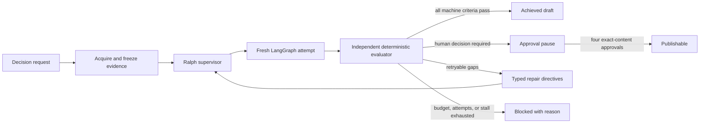
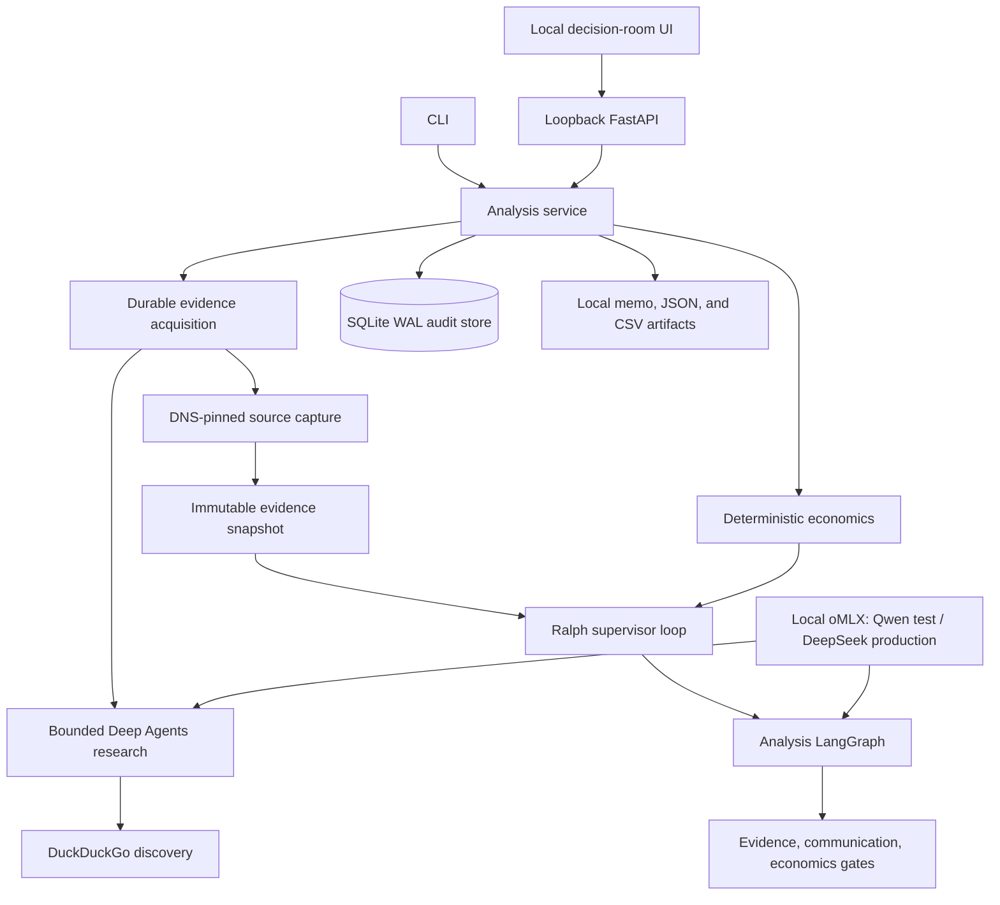

# PorterForcesAI

PorterForcesAI is a local, evidence-led decision toolkit for AI engineers,
architects, and technical strategists advising financial-services boards. It
turns a strategic question into a Porter Five Forces analysis, a traceable
board brief, explicit action/wait/no-action choices, deterministic economics,
and a content-bound human approval workflow.

The toolkit supports global banks, quantitative trading and investment firms,
and insurers. It is decision support, not legal, investment, regulatory, or
financial advice.

## What is implemented

- A typed LangGraph workflow that frames the decision, researches and assesses
  exactly five forces, builds a canonical evidence ledger, challenges the thesis,
  composes a board brief, and applies deterministic quality gates.
- Bounded Deep Agents research workers with only DuckDuckGo search and structured
  output visible to the model. Hidden filesystem, shell, and generic subagent
  tools are excluded and guessed calls are rejected. Each force requests one
  parallel batch, with at most five searches executed; excess calls receive a
  limit error so the model can still return its typed bundle.
- DuckDuckGo empty-result handling that distinguishes the provider's exact
  no-results sentinel from outages. A filtered empty search gets one unfiltered
  retry on DuckDuckGo; timeout, rate-limit, and other provider errors fail closed.
- A separate, overarching Ralph supervisor that executes fresh analysis
  StateGraphs, evaluates explicit goals independently, issues gap-specific
  repair directives, checkpoints every completed attempt, and stops on success,
  human judgment, budget, attempt, or stall limits.
- Immutable query/hit provenance and SSRF-resistant, DNS-pinned HTML, XHTML,
  and plain-text page capture. Search snippets and model memory never become
  public-web evidence; PDF capture is deliberately not implemented in this
  profile.
- Reproducible NPV, ROI, payback, and cost-of-delay calculators using
  finance-owned ranges. Missing values stay missing; the LLM never invents ROI.
- SQLite WAL persistence for acquisition, Ralph attempts, goals, searches,
  captures, immutable artifacts, and exact-content approvals. Startup fails
  interrupted work closed rather than pretending to resume an incomplete model
  call. Every successful search execution is persisted synchronously before its
  tool result returns, so discovery survives a later bundle-generation failure.
- A loopback-only FastAPI service, CLI, and a Contingency Atlas-inspired local
  decision-room UI.
- Offline demo mode with clearly labeled synthetic evidence and live mode using
  local oMLX plus DuckDuckGo.

## Quick start

Prerequisites are Python 3.12, `uv`, Node.js 22+, npm, and—only for live
analysis—an oMLX OpenAI-compatible server.

```bash
cp .env.example .env
uv sync --extra dev
npm --prefix ui ci
./scripts/setup_and_run.sh
```

Open `http://127.0.0.1:3000`. The API documentation is at
`http://127.0.0.1:8765/api/docs`.

To exercise the complete system without a model or network:

```bash
uv run porter-forces run examples/global-bank-ai-adoption.demo.json
```

The example includes illustrative, explicitly owned scenario ranges so the
deterministic ROI and cost-of-delay paths are exercised before synthesis and by
Ralph's acceptance criteria. Artifacts are written under `runs/<run-id>/`; the
public memo and evidence register are also persisted immutably in SQLite.

The default SQLite database, generated artifacts, and `.env` are ordinary local
files, not encrypted application containers. Use workstation full-disk
encryption, restrictive filesystem permissions, and an approved retention path
for confidential runs.

## Local oMLX profile

The checked-in test profile is:

```dotenv
PFA_LLM_MODEL=Qwen3.8-27B-4bit
PFA_LLM_BASE_URL=http://127.0.0.1:8000/v1
PFA_LLM_API_KEY=test
```

Verify inventory, forced tool calling, and JSON-schema output before a live run:

```bash
uv run porter-forces doctor --live-canary
```

Then run the live example:

```bash
uv run porter-forces analyze examples/global-bank-ai-adoption.live.json
```

Production is designed for the locally served DeepSeek profile. Change
`PFA_LLM_MODEL` to the exact DeepSeek ID returned by `GET /v1/models` only after
the same canaries and evaluation suite pass. Model choice does not bypass any
capture, evidence, Ralph, or human-approval gate.

## Ralph supervision

Ralph is outside the analysis StateGraph. The generating graph cannot declare
itself complete. A deterministic evaluator checks the result against explicit
criteria and a frozen evidence snapshot.



This verifies a declared definition of done; it does not guarantee that an
unknown future fact is true. Ralph can—and should—return `blocked` or
`human_required` rather than manufacture completion.

The default draft criteria verify:

- a research-ready decision contract;
- exactly one valid assessment for every Porter force;
- claim/evidence integrity against the immutable capture snapshot;
- an explicit recommendation, no-action case, uncertainty, and smallest
  reversible commitment;
- fidelity to the user's decision and supplied market boundary;
- a bounded analogy for every requested board audience; and
- a traceable contrary basis shared by the challenge and board-visible dissent.

When finance-owned scenario or delay inputs are present, Ralph also verifies
that the exact calculator outputs reach synthesis and the challenge, and that a
wholly negative range is not obscured by an action recommendation.

Live capture selection is application-owned and coverage-first across all five
force candidate sets. `capture_max_sources` is a hard unique fetch-attempt cap:
PDFs, 403s, and other capture failures consume a slot, while later candidates
backfill uncovered forces round-robin within the same cap. Once every force has
one successful capture, remaining slots are balanced for enrichment and
publisher diversity. Source class and conservative
quality/freshness/applicability scores come from policy, not model claims. Each
claim link must carry an exact quote from its captured excerpt and pass a
conservative lexical-alignment screen for facts and inferences. That screen
catches missing or obviously unrelated support; it is not semantic entailment
or proof that a source is true.

Publication additionally requires Strategy, Finance, Technology, and Risk to
approve the SHA-256 fingerprint of the exact current brief. Any material edit
invalidates prior approval authority.

## Architecture



Confidential `internal_context` is available only to the local orchestration and
model boundary. Public research workers receive a separately approved
`public_research_context`; compact live API requests are rejected unless that
sanitized field is explicitly supplied.

## CLI

```text
porter-forces doctor [--live-canary]
porter-forces demo [--question ...] [--target draft|publishable]
porter-forces analyze <submission.json>
porter-forces run <submission.json>
porter-forces runs [--json]
porter-forces show <run-id> [--json]
porter-forces serve
```

`demo` never performs public research. `analyze` always forces live mode. `run`
respects the mode declared in the canonical submission.

## Development verification

```bash
make check
make test
```

The Python suite is offline by default. Live oMLX and DuckDuckGo checks are
explicit so routine CI cannot accidentally cause egress or depend on changing
external pages.

## Documentation

- [Architecture](docs/technical/architecture.md)
- [Ralph loop](docs/technical/ralph-loop.md)
- [Data-flow diagrams](docs/technical/dfd.md)
- [Entity-relationship model](docs/technical/erd.md)
- [Local API](docs/technical/api.md)
- [Security model](docs/technical/security.md)
- [Operations](docs/technical/operations.md)
- [Testing](docs/technical/testing.md)
- [Architecture decisions](docs/technical/adr/README.md)
- [Product blueprint](docs/PROJECT_BLUEPRINT.md)
