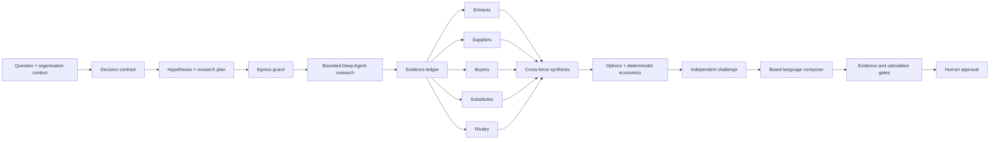

# PorterForcesAI

PorterForcesAI is a proposed **board decision system** for financial-services
technology and strategy questions. It uses Porter’s Five Forces to explain
external pressure, then combines that view with capability fit, deterministic
economics, control acceptability, and the value of waiting.

The target users are AI engineers, architects, and technical strategists who
advise boards in global banking, quantitative trading, and insurance. The first
vertical is deliberately narrower: **AI and cloud decisions in global banking**.

## Target product promise

Given a question such as:

> Should a global bank accelerate generative-AI adoption, and what happens if
> it waits eighteen months?

the completed system will create a decision contract, research current public evidence,
assesses all five forces, compares action/delay/no-action options, calculates
scenario economics, red-teams the thesis, and produces a board-ready brief with
traceable claims and explicit uncertainty.

It is not an autonomous financial adviser and it must not turn model memory or
search snippets into board-visible facts.

## Architecture



- **LangGraph** is the explicit control plane: checkpointable state, map/reduce over
  the five forces, bounded repair loops, and human review.
- **Deep Agents** is used only for bounded research work where planning and
  tool use add value. Its additive scaffolding tools are removed from the
  model-visible schema and guessed calls are rejected; the retained state
  backend has no host-filesystem or shell capability. It does not own the
  overall business process.
- **oMLX** serves the local model through its OpenAI-compatible API, keeping
  confidential prompts local.
- **DuckDuckGo** is a discovery channel through the third-party `ddgs` adapter.
  In the target product, captured underlying pages—not snippets—become evidence.
- **Python calculators and validators** own financial arithmetic, citation
  coverage, egress policy, and quality gates.

## Repository status

This repository contains the greenfield blueprint and a tested walking
skeleton: domain contracts, deterministic economics, an outbound-query guard,
provider adapters, a bounded research-agent constructor, a LangGraph workflow
boundary, and content-bound publication approvals. It does **not** yet contain a
concrete `AdvisorRuntime`, an `analyze` CLI command, source fetching/promotion,
renderers, sector packs, or a live end-to-end analyst. The standalone economics
calculator is not yet wired into graph state or the brief.

Accordingly, the only CLI command today is `doctor`; this repository does not
yet produce a board pack or claim board-grade analysis. The precise boundary
between implemented foundation and planned product is tracked in the blueprint's
implementation slices.

Read [the project blueprint](docs/PROJECT_BLUEPRINT.md) for product behavior,
sector packs, graph design, trust boundaries, delivery phases, and acceptance
criteria.

## Developer setup

Python 3.12 is required by the selected Deep Agents baseline.

```bash
uv sync --extra dev
cp .env.example .env
uv run pytest
uv run porter-forces doctor
```

Run oMLX separately and set `PFA_LLM_MODEL` to an exact id or alias exposed by
`GET /v1/models`:

```bash
omlx serve --model-dir /path/to/models --api-key your-secret
```

Before a future analysis command is enabled, an operator should run
`porter-forces doctor --live-canary` to check tool calling and JSON-schema
output. This is currently a manual, opt-in readiness check, not an automatic
startup gate.
Local inference protects prompt confidentiality; it does not establish factual
accuracy, regulatory compliance, or fitness for a board decision.
