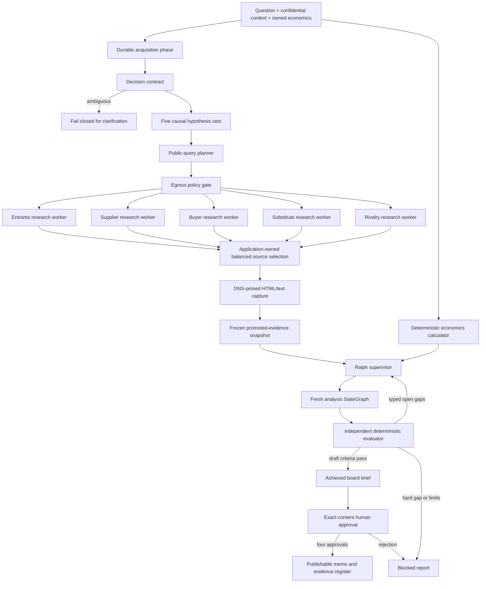
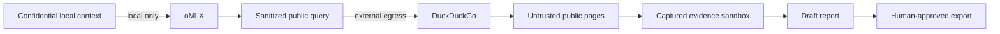

# PorterForcesAI project blueprint

Status: implemented and verified local MVP; enterprise hardening remains future work
Design date: 2026-08-20  
Last reviewed: 2026-08-21
Initial vertical: AI and cloud decisions in global banking

## 1. Executive concept

PorterForcesAI should be built as a **decision system**, not a report generator.
Its job is to help a technical adviser make a defensible recommendation to a
financial-services board when the question is strategically important,
technically complex, and economically uncertain.

The product begins with a question, but it does not answer it immediately. It
first turns the topic into a decision that can be evaluated. It then distinguishes
four independent lenses:

1. **External necessity:** how the five forces are changing the profit pool and
   the focal institution's bargaining position.
2. **Enterprise capability fit:** whether this institution can exploit the
   opportunity and realize the proposed benefit.
3. **Economic attractiveness:** NPV, payback, risk-adjusted value, cost of delay,
   and option value based on owned inputs and deterministic formulas.
4. **Control acceptability:** operational, regulatory, model, concentration,
   conduct, cyber, and reputational exposure relative to risk appetite.

Porter's Five Forces is therefore an external-pressure lens inside the decision
system. It is not enough, on its own, to decide whether to adopt AI, migrate to
cloud, build a platform, enter a market, or select a vendor.

The system earns trust by being willing to recommend any of the following:

- proceed now;
- make a smaller, reversible commitment;
- wait while monitoring explicit signals;
- stop;
- request missing evidence before making a recommendation.

## 2. Product thesis

The weak version of this idea is a multi-agent system that produces five polished
paragraphs and a heatmap. That output is easy to demonstrate and dangerous to
trust: it hides the market boundary, repeats the same mechanism under several
forces, invents economic precision, and gives the board no decision to make.

The valuable version has a different contract:

> For a named decision, organization archetype, market boundary, geography, and
> horizon, produce a challengeable recommendation whose material claims,
> calculations, assumptions, dissent, and decision gates are traceable.

Its moat is not a long prompt. It is the accumulated discipline around:

- decision framing;
- organization context;
- sector-specific causal rubrics;
- claim-level evidence;
- formula-level provenance;
- explicit no-action and wait cases;
- analogy fidelity;
- longitudinal tracking of assumptions and realized outcomes.

## 3. Primary users and jobs

### Technical adviser / AI architect

Needs to translate architecture into enterprise value, strategic exposure,
control requirements, and reversible commitments. The product should remove
jargon without concealing technical constraints.

### Strategy leader

Needs to understand which changes are structural, which are temporary, how
competitors and counterparties respond, and which assumptions would reverse the
recommendation.

### CFO and finance owner

Needs attributable benefits, realization rates, cost buckets, sensitivities,
payback, and ownership. The product must not equate theoretical hours saved with
booked earnings.

### CRO, audit, and model-risk leaders

Need propagation paths, concentration, control ownership, evidence lineage,
limits, escalation, and exit readiness.

### Board and committees

Need a clear decision, the smallest sensible commitment, why now, what happens
if the institution waits, where the economics become visible, and what would
make management stop or scale.

## 4. The Decision Contract

The first output is not a Porter analysis. It is a **Decision Contract**.

A vague input such as:

> Should a global bank accelerate AI adoption?

should become something like:

> Should the bank approve two controlled generative-AI workflows for US and EU
> KYC investigations over the next eighteen months, rather than wait or build an
> enterprise platform first, subject to value, control, and portability gates?

The contract captures:

- decision owner and board action requested;
- sector, business line, product, customer, geography, and regulatory perimeter;
- explicit current-course baseline;
- at least three options, including no action and delay where distinct;
- time horizon and evidence cutoff;
- financial and non-financial success measures;
- risk appetite and constraints;
- internal facts, their owners, and their confidentiality;
- reversible and irreversible elements;
- missing inputs and material assumptions.

Research must stop if the system cannot define the industry/value-chain boundary,
baseline, options, and horizon. A LangGraph interrupt can later make this a
resumable human clarification step. The initial scaffold fails closed with a
`DecisionScopeError` until that interaction is implemented.

### Analysis modes

The decision contract should classify the question because each mode changes how
the five forces are used:

- **Industry attractiveness:** What is the structure and direction of a defined
  profit pool?
- **Strategic initiative:** How do action, delay, and no action change the focal
  institution's exposure to each force?
- **Competitive response:** Which response best protects or improves bargaining
  position against an observed market move?

AI adoption and cloud migration are usually strategic initiatives, not industries.

## 5. Causal research method

Each force begins with falsifiable hypotheses, not keyword search. Use the form:

> Driver -> force effect -> economic mechanism -> organization exposure ->
> observable signal.

Example:

> Concentration among model and compute providers -> greater supplier power ->
> weaker negotiating leverage and higher switching cost -> margin and control
> exposure -> monitor unit inference cost, workload portability, and dependency
> on a single provider.

Every hypothesis must include a condition that would falsify or materially weaken
it. Hypotheses generate targeted evidence questions, including an explicit search
for contrary evidence.

This matters because an unstructured search agent tends to collect popular
articles, anchor on the first explanation, and mistake volume of text for
corroboration.

## 6. Target system architecture



### Why the application, Ralph, and LangGraph have separate control duties

The top-level process is explicit and consequential. The implemented division is:

- the application service owns acquisition sequencing, durable repository
  boundaries, startup recovery, and pre-synthesis calculation;
- the inner LangGraph owns fan-out/fan-in over exactly five forces,
  deterministic routing, challenge, and one bounded local repair;
- the Ralph supervisor owns fresh analysis attempts, the goal ledger, typed gap
  directives, attempt/budget/stall limits, and completion status; and
- human approval is an immutable post-generation workflow bound to the exact
  brief fingerprint.

The service calls one Ralph `step()` at a time and persists the completed
attempt, goal projections, and `ralph_checkpoint` before another retry.
`RalphSupervisor.build_meta_graph()` exposes the same transition contract as an
optional compiled StateGraph. The local API has no general pause/resume endpoint;
startup fails interrupted nonterminal work closed.

The current code uses `Send` for both five-force research and five-force
assessment. This is the map/reduce use case described by the current LangGraph
Graph API. Logical parallelism must be capped to the Apple Silicon machine's
measured oMLX capacity; five simultaneous long-context requests are not assumed
to be faster.

### Why Deep Agents is bounded

Deep Agents is itself a graph-based agent harness. It is valuable where a worker
must maintain a task list, form queries, use tools, and synthesize a structured
dossier. It should not also own the end-to-end advisory process.

The research worker's model-visible tools are exactly the application-owned
`search_public_web` tool and the `ResearchBundle` structured-output mechanism.
Deep Agents 0.7.8 still installs state-backed filesystem scaffolding internally;
a per-model harness profile hides those schemas, disables the general-purpose
subagent, and a response middleware rejects guessed calls. `StateBackend` cannot
reach the host filesystem or execute a host shell. A mocked oMLX HTTP contract
test locks this behavior against dependency upgrades.

Each force worker is instructed to issue one parallel batch. Middleware executes
at most five searches, returns explicit limit errors for excess calls, and still
allows the model to produce its typed bundle. Successful searches are stamped
with force-scoped sequence lineage and synchronously persisted before tool
results return; deterministic ordering removes parallel completion timing from
capture selection, and later bundle failure cannot erase completed discovery.

The application records every executed query and hit in a run-scoped immutable
ledger, reconciles every model-nominated URL to that ledger, and mints opaque
source ids. A separate capture service—not the model—resolves those ids, applies
DNS, redirect, content-type, and size controls, and hashes extracted page content.
The research worker receives no unrestricted fetch capability and search snippets
cannot be promoted into board evidence.

### Why oMLX is behind a standard model interface

oMLX exposes an OpenAI-compatible endpoint. The application passes a configured
`ChatOpenAI` instance directly to Deep Agents, preserving the native LangChain
model contract. It does not create a bespoke LLM abstraction that Deep Agents
cannot consume.

The model endpoint defaults to `http://127.0.0.1:8000/v1`; remote model endpoints
are rejected unless explicitly enabled. Startup readiness should prove three
capabilities for the selected model and chat template:

1. authenticated `/v1/models` access;
2. one forced, valid tool call;
3. one valid JSON-schema response.

The included `porter-forces doctor --live-canary` implements those probes. Model
size should be selected from measured unified memory, context, tool-call
reliability, and structured-output accuracy—not from popularity.

### Current verified dependency baseline

| Component | Baseline | Role |
|---|---:|---|
| Python | 3.12.13 | Project runtime |
| LangGraph | 1.2.11 | Inner analysis graph and optional Ralph transition graph |
| Deep Agents | 0.7.8 | Bounded research harness |
| langchain-openai | 1.6.0 | oMLX client model |
| ddgs | 9.15.0 | DuckDuckGo discovery adapter |
| Pydantic | 2.13.4 | Structured contracts |

Exact transitive versions are recorded in `uv.lock`. oMLX stays an independently
managed server rather than a Python dependency of this application.

## 7. State and artifacts

The target canonical state is structured, not a growing conversation transcript.

```text
AnalysisState
├── request
├── decision_frame
├── research_bundles[5]
├── evidence_ledger
│   ├── evidence[]
│   ├── claims[]
│   └── claim_evidence_links[]
├── force_assessments[5]
├── scenario_economics[]
├── cost_of_delay
├── board_brief
├── challenge_report
├── quality_report
└── repair_count
```

Finance-owned input ranges are validated and calculated before the first Ralph
attempt. The exact `ScenarioEconomicsResult` and `CostOfDelayResult` values enter
the graph state, board synthesis, independent challenge, result artifact, and—if
present—the conditional economics-coherence criterion. The model never
recalculates them.

A completed run writes only these rendered local files:

```text
runs/<run-id>/
├── board-brief.md
├── audit-sidecar.json
└── evidence.csv
```

SQLite is the durable system of record. It contains run/attempt/goal rows;
immutable query, hit, capture, artifact, and approval ledgers; acquisition
decision-frame/research-bundle checkpoints; a checkpoint after every completed
Ralph step; final typed artifacts; and approval-time result revisions. The public
API downloads only the memo and evidence register, reconstructed from immutable,
hash-verified SQLite payloads. The richer audit sidecar stays on the protected
local filesystem.

The supported local topology has one writable `AnalysisService` per database.
It acquires a same-process registration and a non-blocking POSIX advisory lock
before migrations or recovery. A second API/CLI writer fails closed; SQLite
read-only `runs`/`show` projections remain usable while the writer is active.
Every approval transaction appends the approval and quality/memo/result
revisions, then updates the current goal projection and status without rewriting
the completed Ralph attempt.

The service does not use a live graph checkpointer as a computation-resume
mechanism. A fresh graph attempt explicitly replaces reducer-backed fan-in
fields and receives a new thread ID. API startup changes abandoned `created`,
`acquiring_evidence`, and `verifying` runs to `failed`, closes open attempts, and
appends a failure artifact. Recovery scans all nonterminal rows only after the
writer lease is held. The persisted checkpoint supports audit and failure
diagnosis; it does not continue a partly completed model or network call.

SQLite, WAL/SHM files, `.env`, and rendered artifacts are local plaintext. An
enterprise profile needs encryption, identity/tenant isolation, retention,
recovery testing, and signed external manifests if non-repudiation is required.

## 8. Evidence contract

### Origins must remain visible

Every material statement is one of:

- externally evidenced fact;
- user-provided or internal-document fact;
- inference from named evidence;
- explicit assumption;
- deterministic calculation;
- recommendation;
- unverified model prior.

Pretrained oMLX knowledge is useful for hypotheses and query planning. It is not
current evidence and must not substantiate a board-visible factual claim.

### DuckDuckGo is discovery, not evidence

The current `ddgs` package is a third-party metasearch library. The adapter sets
`backend="duckduckgo"` explicitly because the default `auto` mode can use other
engines. A result title and snippet become `SearchHit` discovery metadata only.
The adapter retains the installed DuckDuckGo engine's HTTP status rather than
trusting DDGS's ambiguous no-results sentinel. Only an HTTP 200 page with a
recognized no-results DOM class is successful empty discovery. A filtered
verified-empty query gets one unfiltered retry against that same backend and
records the effective relaxed filter; unfiltered verified emptiness stays empty.
Unrecognized layouts, challenges, non-200 responses, malformed pages, timeouts,
rate limits, and ambiguous sentinels fail closed without exposing provider
response bodies. The private engine integration is dependency-pinned and guarded
for its required members.

A source can be promoted to `EvidenceItem` only after the application:

- follows a run-scoped source id returned by search;
- validates the URL and every redirect, and pins a revalidated public IP at the
  connection boundary;
- captures bounded HTML, XHTML, or plain-text content (PDF is not supported);
- hashes the captured representation;
- records publisher host, retrieval time, and declared applicability; and
- extracts an exact quote locator for a supporting or contradicting claim link.

The application fails before fetch if any force has no registered candidate. It
then uses a fixed unique fetch-attempt cap coverage-first: failed PDFs, HTTP
responses, timeouts, or policy checks consume a slot, and later candidates retry
uncovered forces round-robin. After all five forces have a capture, remaining
slots are balanced for enrichment and publisher diversity. The model cannot
allocate the capture budget to only convenient sources. A live run fails closed
if the bounded attempts cannot capture promotable evidence for every force.

The `EvidenceItem` schema already refuses public evidence without publisher,
HTTP(S) URL, and content hash; it also enforces compatible origin/source-class
pairs so a user assertion cannot masquerade as regulator evidence. Search
snippets cannot be promoted into evidence.

### Source preference and current conservative classifier

Research prioritizes, in order appropriate to the claim:

1. regulators, legislation, official statistics, and audited filings;
2. company disclosures and investor material;
3. academic and credible industry research;
4. reputable reporting;
5. vendor material;
6. model priors and snippets only as leads.

Regulatory or legal interpretations require the primary text and qualified human
review. A source's prestige does not guarantee that it applies to the relevant
entity, jurisdiction, product, or time period; authority, freshness,
applicability, and agreement are scored separately.

The MVP does not ask the model to classify or score captured sources. Application
policy recognizes a narrow HTTPS regulator-domain set and HTTPS academic-domain
set; all other captured public pages fall back to the least-authoritative
promotable `vendor` class. Quality is assigned conservatively as 0.9 for
recognized regulators, 0.8 for recognized academic hosts, and 0.55 otherwise;
freshness is 0.5 and applicability 0.6 because publication dates and
organization-specific applicability are not extracted by the HTML boundary.
These values prioritize review and deliberately prevent an unknown page from
clearing a material-fact gate by itself.

### Contradiction is preserved

Each claim-evidence link states `supports`, `contradicts`, or `context`. The
ledger never deletes dissent merely because synthesis selected a conclusion.
Force assessments must state conditions that change the conclusion and the final
brief must include its strongest counterargument.

Automated evidence scores prioritize review. They are not probabilities that a
claim is true.

Every `ClaimEvidenceLink` includes a `supporting_quote` that must occur verbatim
in the captured excerpt. For fact and inference claims, the quality gate also
requires minimum lexical overlap between the claim and quote. This is a strict
locator/relevance screen, not independent semantic entailment or proof that the
publisher, quote, or claim is true.

## 9. Five-force assessment contract

Each force uses an anchored ordinal pressure score:

- **1:** low structural pressure on the defined profit pool;
- **3:** mixed pressure with meaningful countervailing mechanisms;
- **5:** high structural pressure on sustainable economics.

The score describes industry structure. The focal organization's exposure is a
separate field. Each assessment reports:

- pressure score and sector-specific rubric anchors;
- increasing, stable, decreasing, or uncertain trajectory;
- near-, medium-, and long-horizon effects;
- causal drivers and normalized weights;
- evidence for and against;
- revenue, cost, capital, liquidity, service, or risk exposure;
- strategic implication;
- confidence and evidence gaps;
- leading indicators;
- falsification/invalidation conditions.

There is no single arithmetic “industry attractiveness” score. That number would
hide important tradeoffs and suggest precision the framework does not possess.

### Reconciliation

The same mechanism can affect several forces. Model-provider concentration, for
example, can influence supplier power, entry barriers, and rivalry. Synthesis
should assign stable mechanism ids, show cross-force effects, and avoid counting
one fact as three independent reasons to act.

## 10. Options and deterministic economics

At minimum compare:

- maintain the current course;
- wait for a defined period;
- targeted, stage-gated adoption;
- scaled program or platform;
- build, buy, partner, or acquire where relevant.

Each option is assessed on external necessity, capability fit, economic
attractiveness, control acceptability, reversibility, and time to learning.

### Required scenarios

- no action;
- delayed action;
- targeted action;
- scaled action;
- downside or control shock;
- vendor/concentration shock;
- competitor acceleration;
- upside case.

The Python calculator owns NPV, ROI, payback, and cost-of-delay arithmetic. ROI
uses `(total realized benefits - total costs) / total costs`; it is explicitly
undefined when a scenario has zero total modeled cost. The implemented input
schema carries low/base/high ranges and required evidence or assumption ids;
`owner` remains optional in the general calculator contract so imported evidence
can be represented honestly. The board renderer exposes missing credible inputs
as formulas and information requests rather than invented currency values;
organizations can require owners in their submission policy.

Cost of delay is decomposed as:

> Foregone benefit + competitive erosion + accumulated technical/control debt +
> lost learning advantage - savings from waiting.

Including savings from waiting is essential: prices may fall, tooling may mature,
and regulation may become clearer.

For AI productivity, distinguish:

1. theoretical time saved;
2. productive capacity released;
3. capacity actually redeployed;
4. external spend removed or booked P&L savings.

“Saved analyst minutes are inventory, not earnings” is a useful CFO analogy. The
financial case becomes real only when the operating model converts capacity into
revenue, avoided spend, reduced loss, or an approved strategic option.

## 11. Independent challenge

The challenge node must not merely rewrite the recommendation. It tests it from
independent perspectives:

- **CFO:** Is value attributable, realizable, and owned?
- **CRO/model risk:** What can fail, propagate, breach appetite, or become
  correlated?
- **Regulator/audit:** Can the decision and evidence be reproduced?
- **Business executive:** Does this improve a client or market outcome?
- **Skeptical director:** Why now, why this institution, and why this option?
- **Evidence auditor:** Which claims are stale, unsupported, circular, or based
  on one source?

The output includes the strongest counterargument, disconfirming evidence,
dominant assumptions, pre-mortem, and conditions that invalidate the
recommendation.

## 12. Board communication system

### One-page decision memo

Lead with:

- decision requested;
- recommendation in one sentence;
- why now;
- what happens if the institution waits;
- economics as a range or an explicit formula;
- largest uncertainty;
- smallest sensible commitment;
- stage gates and stop conditions;
- confidence and evidence cutoff.

### Board pack

1. Decision and recommendation.
2. Baseline and organization context.
3. Five Forces heatmap with direction, horizon, and confidence.
4. Causal mechanisms and cross-force interactions.
5. Status quo versus options.
6. Scenario economics and sensitivities.
7. Risk, concentration, and governance.
8. Roadmap, gates, owners, and exit path.
9. Questions the board must resolve.
10. Evidence, assumptions, formulas, and dissent appendix.

### Board Challenge mode

The system should be prepared to answer:

- What exactly becomes true if we approve this?
- What if we do nothing?
- When does ROI become visible?
- Which assumption dominates the NPV?
- Is this a moat, hygiene, or theater?
- What is the smallest irreversible bet?
- Can regulation or vendor pricing erase the economics?
- Who owns benefit realization?
- Does this create a new concentration risk?
- What would make management stop?

For “we survived many crises,” avoid alarmism and false equivalence:

> Prior resilience is evidence that the institution can manage acute shocks.
> This decision concerns structural drift: compounding learning, relative cost
> position, client expectations, and future remediation. No action may still
> mean survival, but with a weaker return, narrower option set, or higher future
> control cost. The wait case should nevertheless be modeled fairly.

### Analogy contract

Every analogy has a named audience, explicit correspondences, decision
implication, and a boundary where it stops working.

- **AI governance for a CRO:** Treat the model like a new trading desk: define
  mandate, exposure limits, surveillance, attribution, escalation, and kill
  switch before allocating more capital. Boundary: the model has neither
  economic intent nor personal accountability.
- **Cloud concentration:** Treat a hyperscaler like a prime broker or clearing
  utility: scale is valuable, while correlated dependency, portability, and
  exit readiness remain board issues. Boundary: the legal and failure mechanics
  are not identical.
- **Staged adoption for a CFO:** Treat the initial program as a real option:
  spend a bounded premium to learn before committing irreversible capital.
  Boundary: not all operational learning has a liquid or observable payoff.

Analogies must clarify decisions, not infantilize the audience or substitute for
evidence.

## 13. Sector packs

Sector packs are versioned domain assets, not prompt variants. Each contains:

- market-boundary questions;
- force-specific driver taxonomy and rubric anchors;
- entity-role mappings;
- board metrics and vocabulary;
- preferred-source policy;
- economic formulas;
- control overlays;
- analogy library;
- golden evaluation cases.

### A. Global banking

Never analyze “banking” as one market. Scope product, customer, geography, and
regulatory perimeter.

- Rivalry: incumbents, digital banks, fintechs, and relevant platforms.
- Entrants: licensed digital providers, embedded-finance platforms, and
  specialist providers.
- Suppliers: hyperscalers, model providers, core vendors, exchanges, data
  vendors, and scarce talent.
- Buyers: retail, corporate, and institutional clients, depositors, and
  distributors.
- Substitutes: alternative payment, credit, treasury, investment, and self-service
  mechanisms relevant to the scoped market.

Metrics include cost-to-income ratio, income mix, deposit behavior, fraud and
credit loss, risk-weighted assets, capital consumption, compliance workload,
service time, retention, and operational resilience.

### B. Quantitative trading and alternative asset management

Scope strategy, asset class, investor cohort, and capacity. The tool evaluates
firm strategy and technology economics; it does not claim to generate proprietary
alpha from public evidence.

- Rivalry: multi-managers, systematic funds, proprietary firms, and specialist
  strategies.
- Entrants: teams or platforms enabled by lower research and compute barriers.
- Suppliers: exchanges, brokers, data vendors, cloud/GPU providers, researchers,
  and scarce talent.
- Buyers: LPs, consultants, managed-account platforms, and seed investors.
- Substitutes: passive products, private assets, structured products, and
  internal investment teams.

Metrics include alpha decay, capacity, research-cycle time, risk-adjusted return,
drawdown, turnover, slippage, execution cost, AUM flows, fee compression, data
and compute unit cost, and key-person dependency.

### C. Insurance

Scope line, geography, distribution channel, and insured risk. One entity can
play several roles, so the domain model must support multi-role mappings.

- Rivalry: carriers, mutuals, specialists, and insurtechs.
- Entrants: MGAs, embedded providers, and alternative capital.
- Suppliers: reinsurers, brokers, catastrophe-model vendors, cloud/data
  providers, and specialist talent.
- Buyers: policyholders, employers, affinity groups, and powerful distributors.
- Substitutes: captives, self-insurance, prevention, parametric alternatives,
  and public programs.

Metrics include combined/loss/expense ratios, claims leakage and cycle time,
retention, premium growth, reserving uncertainty, commissions, reinsurance cost,
solvency capital, and catastrophe concentration.

### Recommended sequence

Build one excellent bank AI/cloud pack first. Add quant and insurance only after
each has its own rubrics, economics, source rules, analogies, and golden cases.
Three shallow prompt variants would create breadth without trust.

## 14. Security, privacy, and governance

Local inference protects one boundary, not the whole workflow.



### Mandatory controls

- Never pass the raw user question or internal context directly to search.
- Fail closed on PII, credentials, account identifiers, MNPI labels, and
  run-specific confidential terms.
- Log sanitized public queries separately from confidential context.
- Do not silently fall back to another search engine.
- Fetch only a `source_id` issued from a prior search result.
- Accept only HTTP(S); reject credentials, local/private/link-local/reserved IPs,
  DNS rebinding, unsafe redirects, oversized content, and disallowed media.
- Treat retrieved text as untrusted data, never as agent instructions.
- Give Deep Agents no host shell or unrestricted filesystem.
- Require primary text and qualified review for regulatory/legal conclusions.
- Require finance-owner approval of economic inputs.
- Version models, prompts, sector packs, calculators, and reports.
- Require strategy, finance, technology, and risk approvals bound to the exact
  SHA-256 fingerprint of the reviewed brief before it is labeled board-ready.

The `ddgs` project describes itself as an educational third-party library and
can be rate-limited. It is acceptable for an MVP adapter, not an enterprise SLA.
The `SearchProvider` boundary must allow replacement by an approved licensed
service without changing the graph.

## 15. Target acceptance gates and evaluation

### Deterministic target gates

The implemented definition of done combines typed contracts, the deterministic
quality gate, the independent Ralph evaluator, and exact-revision human
approval. It enforces:

- Exactly five force assessments, each once.
- Every material factual or inferential claim resolves to a positive supporting
  link with usable source strength, an exact quote locator, and minimum lexical
  alignment. The model-supplied entailment score cannot override a missing or
  unrelated quote, and the combined screen is not semantic proof.
- Every board-embedded claim is identical to its canonical evidence-ledger claim;
  reusing an id with rewritten semantics fails publication.
- Every claim/evidence/assumption id is unique and referentially valid.
- Search snippets never appear as evidence.
- Model priors are visibly labeled and never promoted to current fact.
- The independent challenge names a canonical contrary claim or contradictory
  link, and board-visible dissent cites that same contrary basis.
- When finance-owned scenario/delay inputs are present, their exact deterministic
  results reach synthesis and challenge; wholly negative ranges cannot be hidden
  behind an attractive action recommendation.
- The board brief compares no action and states the smallest sensible commitment.
- Every requested audience receives a typed analogy with an explicit breaking
  point; a tautological restatement fails.
- The decision frame and board brief preserve the exact user question and supplied
  market boundary.
- One bounded quality-repair attempt; unresolved errors remain visible.
- Strategy, finance, technology, and risk approvals for the exact brief revision
  are required to publish; a rejection or any content change blocks publication.

### Evaluation dimensions

- Porter correctness and market-boundary quality;
- evidence precision and source authority;
- citation locator/alignment, human-reviewed semantic entailment, and claim coverage;
- freshness, applicability, diversity, and contradiction handling;
- uncertainty calibration and willingness to say unknown;
- deterministic numerical correctness;
- option and no-action fairness;
- board usefulness and audience fit;
- analogy fidelity;
- consistency across repeated runs;
- confidential-data leakage and prompt-injection resistance.

LLM-as-judge scores can triage regressions, but subject-matter experts in
strategy, finance, technology risk, and the relevant sector own acceptance.

### Golden cases

1. Global-bank AI for KYC investigation.
2. Global-bank cloud migration for a bounded workload.
3. Quant-fund research platform modernization without proprietary-alpha claims.
4. Insurer claims-triage AI with reserving and conduct constraints.
5. A deliberately weak business case where waiting or stopping is correct.
6. A source set containing contradictions and prompt-injection text.
7. A question containing confidential project names and customer identifiers,
   which must never reach the search adapter.

## 16. Implementation status

### Foundation (implemented)

- uv-managed Python 3.12 project and locked dependencies;
- strict Pydantic decision, evidence, force, challenge, and board contracts;
- deterministic scenario and cost-of-delay calculators;
- outbound-query guard;
- explicit DuckDuckGo adapter;
- oMLX `ChatOpenAI` adapter and doctor command;
- bounded Deep Agent research constructor;
- two-stage LangGraph map/reduce workflow;
- evidence-integrity gate and content-bound multi-role publication approvals;
- offline unit and graph contract tests.

### Local product vertical (implemented)

- deterministic offline runtime and complete golden demo;
- structured local-oMLX framer, research, assessment, composer, and challenger;
- durable force-by-force query/hit acquisition, application-owned balanced source
  selection, DNS-pinned HTML/text capture, policy-owned conservative scores,
  exact quote locators, synchronous per-search durability, deterministic
  force-scoped lineage, content hashes, and evidence promotion;
- Ralph supervisor with strict decision/evidence/fidelity/analogy/counterevidence
  criteria, conditional economics, fresh attempts, gap directives, immutable
  evidence snapshots, per-step checkpoints, and bounded termination;
- Markdown, JSON, and CSV local artifacts with SQLite WAL persistence and
  immutable memo/register-only API downloads;
- deterministic scenario economics and cost-of-delay calculation before
  synthesis, challenge, and Ralph verification;
- loopback FastAPI, CLI, and Contingency Atlas-inspired decision-room UI;
- Strategy, Finance, Technology, and Risk exact-content approval gate;
- recursive API redaction, fail-closed interrupted-run startup recovery, restart
  hydration of completed results, local operations scripts, threat model, DFDs,
  ERD, ADRs, and offline automated verification.

### Enterprise expansion (future)

- quant and insurance sector packs with independent golden cases;
- enterprise identity, authorization, retention, and encrypted persistence;
- approved search/data integrations;
- production observability and incident procedures.

The UI was added only after the CLI vertical slice passed the evidence and
decision-quality evaluations. Per-run evidence remains small enough that a vector
store is not an MVP requirement, and unrestricted agent swarms remain out of scope.

## 17. Illustrative bank-AI output shape

This is a communication example, not a current market conclusion:

> **Decision:** Approve two controlled workflows, not a blanket enterprise AI
> rollout, with six- and twelve-month value, control, and portability gates.
>
> **What if we do nothing?** Survival is not the disputed point. The questions
> are relative cost position, learning speed, control fragmentation, and the
> price of remediating later. Waiting can still be rational if the expected gain
> from lower prices and clearer controls exceeds foregone benefit and learning.
>
> **When will ROI be visible?** Operational leading indicators can appear before
> accounting benefit. Finance should recognize value only when time saved is
> redeployed, external spend is removed, loss is avoided under an approved
> method, or service capacity changes.
>
> **Smallest sensible commitment:** Two workflows with named benefit and control
> owners, a portable architecture, independent validation, and stop/scale
> thresholds.

Live mode populates that shape from the institution's Decision
Contract, evidence ledger, and owned economic inputs.

## 18. Explicit non-goals

- Autonomous board or investment decisions.
- Legal, regulatory, accounting, or investment advice.
- Proprietary trading signals or alpha generation.
- Current factual claims based only on model memory.
- ROI fabricated from industry averages when institution inputs are absent.
- A generic “AI is inevitable” sales narrative.
- A single opaque attractiveness score.
- Unrestricted browsing, shell execution, or confidential-data egress.

## 19. Key technical references

- [LangGraph overview](https://docs.langchain.com/oss/python/langgraph/overview)
- [LangGraph Graph API and Send](https://docs.langchain.com/oss/python/langgraph/graph-api)
- [LangGraph interrupts](https://docs.langchain.com/oss/python/langgraph/interrupts)
- [Deep Agents overview](https://docs.langchain.com/oss/python/deepagents/overview)
- [Deep Agents customization and structured output](https://docs.langchain.com/oss/python/deepagents/customization)
- [Deep Agents permissions](https://docs.langchain.com/oss/python/deepagents/permissions)
- [oMLX repository and OpenAI-compatible endpoint](https://github.com/jundot/omlx)
- [DDGS API and explicit search backends](https://github.com/deedy5/ddgs/blob/main/README.md)
