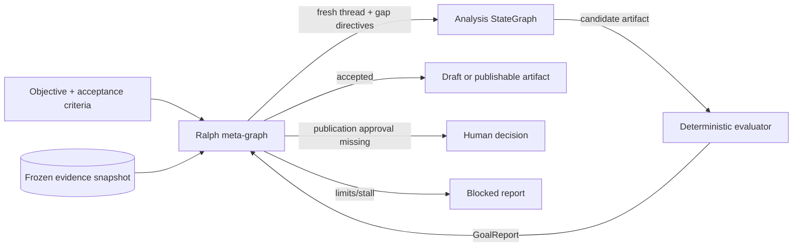
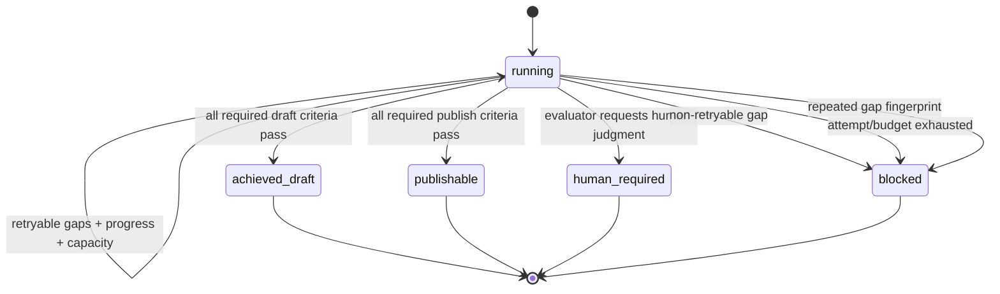

# ADR 001: Use a bounded Ralph meta-orchestrator

- Status: Accepted
- Date: 2026-08-20
- Decision owners: Architecture and Strategy Engineering

## Context

The analysis StateGraph already controls research, evidence promotion, force
assessment, synthesis, challenge, and local repair. Its output is still
model-influenced. Allowing that graph, or a model inside it, to declare the
overall objective complete would create circular assurance.

Board advice also has legitimate non-computable stopping conditions. Missing
finance inputs and risk approvals require people; repeated searches do not turn
those conditions into facts. Conversely, unbounded retries can increase cost,
cherry-pick changing public evidence, or repeatedly produce the same defect.

## Decision

Place a separate Ralph supervisor around the complete analysis graph. The
supervisor owns a typed goal ledger and accepts completion only from an
independent deterministic evaluator. `RalphSupervisor.build_meta_graph()` can
compile the transition contract as a LangGraph `StateGraph`; the application
service intentionally calls `step()` in an explicit bounded loop so it can
persist every completed attempt before starting a retry.

The following invariants are mandatory:

1. Every attempt has a fresh attempt ID and nested LangGraph thread ID.
2. Every attempt in a run uses one immutable evidence snapshot ID.
3. The evaluator reports every declared criterion exactly once.
4. Analysis output fields such as `done`, `valid`, or `confidence` have no
   authority over Ralph status.
5. Failed criteria produce typed retry directives.
6. A missing publication approval returns `human_required` immediately; a
   reviewer rejection returns `blocked` and requires a new content revision.
7. Attempt, budget, non-retryable-gap, and stall limits fail closed.
8. `publishable` requires a publishability target whose required criteria
   include approval verification; draft achievement is a distinct status.
9. The service writes the attempt/report, goal projection, and serialized Ralph
   checkpoint before another retry begins.

The draft definition of done checks the decision contract, all five force
assessments, captured-evidence integrity, the board decision, one bounded analogy
per requested audience, fidelity to the exact question and market boundary, and
canonical counterevidence shared by challenge and board-visible dissent. When
finance-owned scenario or delay calculations are supplied, a conditional
economics-coherence criterion also checks their exact propagation and treatment.

## State transitions

## Alternatives considered

### Extend the analysis graph's existing repair edge

Rejected as the overarching control. It is useful for local formatting and
quality repairs, but it shares the artifact-generation context and therefore
cannot independently establish goal completion.

### Let an LLM critic decide when to stop

Rejected as an authority. LLM criticism can nominate gaps, but deterministic
criteria, evidence linkage, economics, and approval checks decide status.

### Search again on every retry

Rejected by default. It changes the evidence universe between attempts and can
create accidental cherry-picking. Evidence refresh is an explicit new run.

### Retry indefinitely

Rejected because it has unbounded cost and no reliable way to distinguish hard
external blockers from work that merely needs another generation.

## Consequences

Positive consequences:

- A persisted manifest explains why every retry and terminal state occurred.
- Existing or future analysis graphs can be wrapped through a small protocol.
- Tests can force every route without a model, network, or live oMLX server.
- Fresh nested threads prevent reducer and checkpoint state from leaking across
  attempts.

Costs and limitations:

- Product teams must define meaningful criteria and deterministic evaluators.
- A passing definition of done is assurance about the contract, not proof that
  an uncertain strategic forecast is true.
- Snapshot refresh and post-human-decision revision are explicit new-run or
  approval workflows, not silent transitions inside this loop. The local API has
  no general pause/resume endpoint.
- The meta-graph adds persistence and observability records that must be
  retained according to the organization's data policy.
- A persisted Ralph checkpoint is an audit/recovery boundary, not a promise to
  resume a partly completed model or network operation. Startup fails
  interrupted nonterminal runs closed.

## Verification

Offline tests cover first-attempt success, gap-directed retry then success,
publishable targeting, human pause, maximum-attempt blocking, budget blocking,
stall blocking, evidence snapshot tampering, incomplete evaluator reports,
strict audience/fidelity/counterevidence/economics criteria, per-attempt durable
checkpoints, startup interrupted-run recovery, and the compiled LangGraph
meta-loop.
