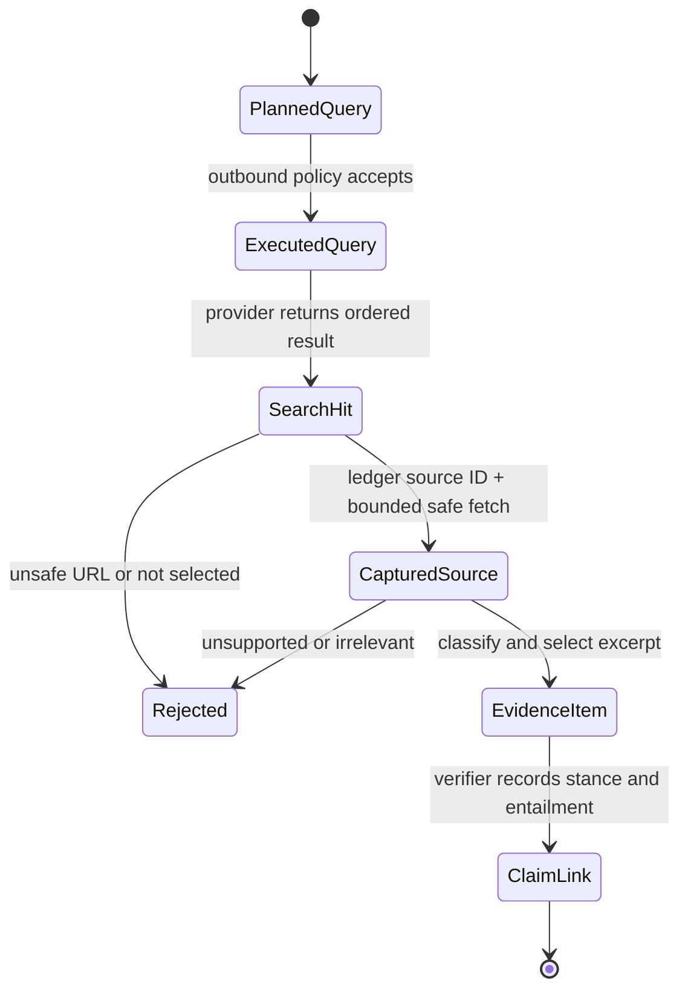

# ADR 002: Separate discovery from content-addressed evidence capture

- Status: Accepted
- Date: 2026-08-20
- Decision owners: Architecture, Research Engineering, and Information Security

## Context

DuckDuckGo returns titles, URLs, and snippets. That metadata is useful for
finding possible sources, but it is not a stable representation of a source and
cannot substantiate a board-visible claim. Letting a model fetch arbitrary URLs
would also create an SSRF capability, make redirects invisible, and erase the
audit relationship between an executed query and the material eventually cited.

Public pages are hostile input. They can contain prompt injection, scripts,
misleading markup, oversized responses, redirect chains, and links to local
services. Retrieval must therefore be a narrow application capability rather
than a general model tool.

## Decision

Use three explicit trust states:

1. `SearchHit` is untrusted discovery metadata.
2. `CapturedSource` is a bounded, hashed representation of a registered hit.
3. `EvidenceItem` is a classified excerpt promoted from a capture.

The append-only `DiscoveryLedger` records the exact executed query and ordered
hits. It alone mints source IDs. The capture service accepts a source ID and
resolves its URL from that ledger; it has no API that accepts a caller-supplied
URL.



Every request and redirect hop is canonicalized and checked before network
access. The capture policy:

- permits only absolute HTTP and HTTPS URLs without credentials;
- permits only configured web ports (80 and 443 by default);
- rejects local host suffixes and literal non-global addresses;
- resolves all advertised addresses and rejects the target if any address is
  private, loopback, link-local, reserved, multicast, unspecified, malformed,
  or otherwise non-global;
- performs redirects manually, repeats URL and DNS validation on every hop,
  detects loops, limits redirect count, and rejects HTTPS downgrade by default;
- disables environment proxy inheritance for its owned HTTP client;
- accepts only configured textual media types;
- bounds timeout, declared content length, bytes actually decoded, and extracted
  characters;
- hashes the captured bytes and extracted text with SHA-256; and
- removes scripts, styles, templates, SVG, control characters, and HTML markup
  using the Python standard library.

The clean text is still labeled `untrusted_external_content`. Cleaning is data
reduction, not a claim that the page is safe or true. Models receive it as
quoted source material under a separate instruction boundary, never as system
instructions and never as executable content.

```mermaid
sequenceDiagram
    participant A as Analysis worker
    participant L as Discovery ledger
    participant C as Safe capture
    participant D as DNS resolver
    participant H as Public host
    participant E as Evidence promoter

    A->>L: Capture source S-123
    L-->>C: Registered hit URL + query provenance
    C->>D: Resolve canonical host
    D-->>C: All addresses
    alt any address is non-global
        C-->>A: Reject and retain evidence gap
    else all addresses allowed
        C->>H: GET, redirects disabled
        H-->>C: Response or redirect
        loop each redirect
            C->>D: Revalidate new canonical host
        end
        C->>C: Enforce type/size; extract; hash; label untrusted
        C-->>E: CapturedSource
        E-->>A: EvidenceItem with capture hash
    end
```

## Snapshot rule

A Ralph run evaluates attempts against one immutable evidence snapshot. New
captures can be appended during an explicit research phase, but the snapshot is
sealed before candidate generation. A retry does not silently search again.
Refreshing public evidence creates a new snapshot and therefore a new run or an
explicitly approved refresh transition.

The current persistence layer stores immutable query, hit, and capture records.
Snapshot-manifest construction binds the selected capture IDs and hashes; it is
the orchestration layer's responsibility to seal that manifest before the Ralph
loop starts.

## Alternatives considered

### Treat search snippets as evidence

Rejected. Snippets are provider-selected fragments without stable context,
publisher verification, or a captured representation.

### Give the research agent an unrestricted HTTP client

Rejected. It would let model output choose network destinations, including
local services, and would bypass the executed-query ledger.

### Fetch first and validate the final URL afterward

Rejected. SSRF prevention must occur before every request, including redirects.

### Store raw HTML indefinitely

Rejected as the default. The system stores bounded extracted text plus hashes
and metadata. Retaining raw documents would increase sensitive-data and
copyright exposure and requires a separately approved retention policy.

## Consequences

Positive consequences:

- Every public evidence item reconciles to a registered search hit and exact
  captured representation.
- Search-provider metadata cannot silently become proof.
- Network behavior is deterministic enough to test without live internet.
- Content and redirect limits cap memory, latency, and model-context exposure.

Costs and limitations:

- Only HTML, XHTML, and plain text are captured. PDF and other formats need a
  separately sandboxed extractor and ADR.
- DNS validation in the application is defense in depth, not a replacement for
  an operating-system or network egress rule. Production deployments must deny
  private and metadata-service destinations at the network layer as well,
  eliminating DNS-rebinding and resolver/connection race exposure.
- A content hash proves which bytes were processed, not authenticity or truth.
- Source-class assignment, excerpt selection, and claim entailment remain
  separate reviewable decisions.

## Verification

Offline tests use `httpx.MockTransport` and an injected resolver. They cover
ledger immutability, query/provider reconciliation, source-ID enforcement,
canonicalization, private DNS, mixed public/private DNS answers, manual redirect
validation, redirect loops and limits, HTTPS downgrade, unsupported types,
declared and streamed size limits, timeouts, clean extraction, content hashes,
truncation labels, and provenance-compatible evidence promotion.
