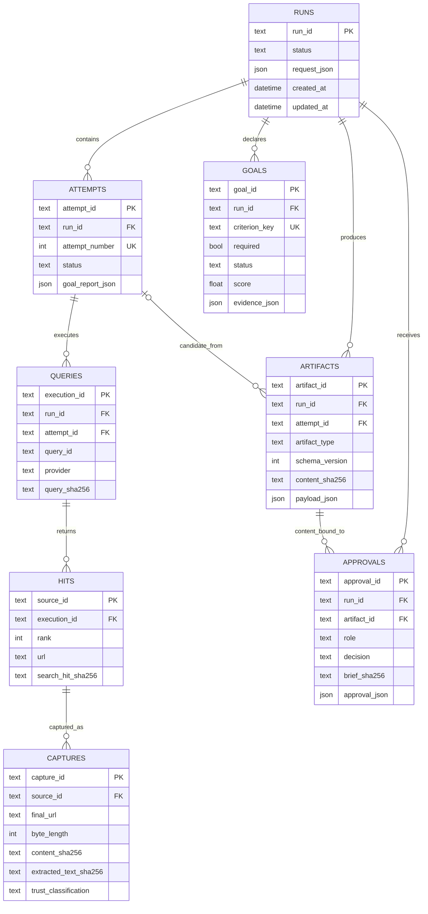
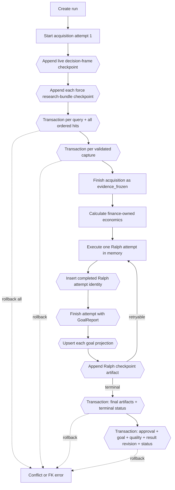

# ADR 003: Use a local SQLite run store with immutable audit ledgers

- Status: Accepted
- Date: 2026-08-20
- Decision owners: Architecture and Platform Engineering

## Context

The Ralph supervisor needs durable state across fresh analysis attempts. It must
explain which goals were active, which queries actually ran, which pages were
captured, which artifact revision passed a gate, and which exact revision a
human approved. Files scattered across run directories do not provide atomic
foreign-key relationships. A remote database would add deployment and data-flow
complexity to a deliberately local-first tool.

## Decision

Use one SQLite database per local deployment through `SQLiteRunRepository`.
Only a local filesystem path is accepted; URI-style and remote-looking database
endpoints are rejected. `:memory:` is allowed for isolated tests. The repository
enables:

- `PRAGMA journal_mode=WAL` for file-backed concurrent readers;
- `PRAGMA foreign_keys=ON` for provenance relationships;
- `PRAGMA synchronous=NORMAL` and a five-second busy timeout;
- numbered, recorded, forward-only schema migrations;
- immediate write transactions and nested savepoints;
- canonical UTF-8 JSON plus SHA-256 for artifacts;
- immutable approval records bound to an artifact content hash; and
- `PRAGMA optimize` during maintenance and orderly close.

Executed queries, search hits, captures, generated artifacts, and approvals are
append-only. SQLite triggers reject updates and deletes even if application code
accidentally issues them. Run, attempt, and goal status fields remain mutable
because they represent controlled state transitions; completed attempt reports
and immutable artifacts preserve their history.

## Entity-relationship model

The `(run_id, attempt_id)` composite relationship prevents a query or artifact
from being attached to an attempt belonging to another run. A capture can be
inserted only if its source ID already exists in `hits`; application validation
also reconciles execution ID, query ID, and discovered URL.

## Phase and transaction boundaries

A query and its complete ordered hit set are committed atomically. A duplicate
source ID, rank, or canonical URL rolls back the query as well as every hit.
Nested repository operations use savepoints, allowing a bounded unit of work to
roll back without corrupting its outer transaction. Acquisition is attempt 1;
database attempt numbers 2 onward correspond to completed Ralph manifests.

In live mode, the decision frame is checkpointed before research. Each
successful query/hit execution is assigned force-scoped sequence lineage and
committed synchronously before its tool result returns; the completed force
bundle is appended afterward. This preserves partial discovery if bundle
generation later fails. Captures are appended one at a time.

The Ralph attempt row, goal projections, and checkpoint are separate bounded
transactions. The service does not begin a retry until all of them return
successfully. A process interruption between these commits can leave a partial
audit tail; startup retains that evidence, closes open attempts, and fails the
nonterminal run rather than resuming or declaring it complete.

By contrast, the final immutable database outputs and terminal status are one
outer repository transaction, and each approval plus its derived goal, quality
report, result revision, and new status is one outer transaction. Local rendered
file writes are filesystem operations and are not part of SQLite rollback.

## Migrations and indexes

Migration 1 creates the core entities and constraints. Migration 2 adds query
indexes and immutability triggers. Applied versions are written to
`schema_migrations` and mirrored in `PRAGMA user_version`; reopening a database
is idempotent.

Indexes serve the expected access paths:

- latest attempts for one run;
- required goals by run and status;
- queries for one attempt in execution order;
- ordered hits for one query and hit lookup by URL;
- capture history for one source;
- artifacts by run, type, and creation time; and
- approval decisions by artifact and role.

## Alternatives considered

### JSON files only

Rejected. Atomic multi-entity writes, uniqueness, foreign keys, indexes, and
concurrent local reads would have to be recreated in application code.

### PostgreSQL from the first release

Rejected for the local-first deployment. It adds a service, credentials,
network boundary, backup workflow, and operational burden before multi-host
writers are required.

### Mutable records with an `updated_at` field

Rejected for evidence and approval provenance. An update would erase what was
actually searched, captured, generated, or approved. New facts and revisions
are appended under new content-addressed or generated IDs.

## Consequences

Positive consequences:

- A local run is portable and inspectable with standard SQLite tooling.
- Foreign keys and triggers provide defense beyond Python validators.
- WAL permits the local UI to read progress while a worker commits bounded
  transactions.
- Canonical JSON makes approval and artifact hashes reproducible.
- Public memo and evidence-register downloads are served from the newest
  hash-verified immutable SQLite payload, not from mutable rendered files.

Costs and limitations:

- SQLite is a single-writer store. A multi-host service or sustained concurrent
  write workload requires a new storage ADR and repository implementation.
- WAL creates `-wal` and `-shm` sidecar files that backup tooling must treat as
  part of a live database.
- Local filesystem permissions and full-disk encryption remain deployment
  responsibilities.
- Database triggers intentionally prevent destructive run deletion while audit
  children exist. Retention deletion needs an explicit, separately authorized
  archival workflow.
- Schema migrations are forward-only; backups must precede production upgrades.
- Ralph checkpoints preserve completed-attempt state for audit and recovery
  diagnosis, but the local service does not resume interrupted model/network
  execution. Startup marks nonterminal runs failed and requires a new run.

## Verification

Tests cover migration idempotence, WAL and foreign-key configuration, required
indexes, run/attempt/goal lifecycle, cross-run attempt rejection, atomic search
insertion, source-registration enforcement, capture round trips, immutable
triggers, nested transaction rollback, canonical artifact hashes, approval
fingerprint matching, reopen persistence, local-path enforcement, optimization,
and closed-repository behavior.
