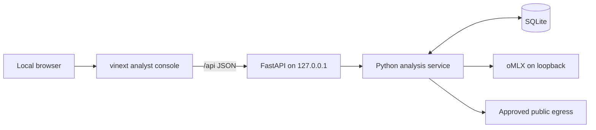

# ADR 004: Use a loopback API and separate local analyst console

- Status: Accepted
- Date: 2026-08-20
- Decision owners: Architecture and Strategy Engineering

## Context

The toolkit needs more than a command-line report. An adviser must observe Ralph
attempts, compare all five forces, inspect evidence lineage, challenge economics,
read the board brief, and collect approvals. At the same time, the initial
confidentiality boundary is a single managed workstation with local oMLX—not a
public SaaS product.

Embedding the analysis engine in a browser process would mix orchestration,
persistence, model access, and rendering. Binding a general API to the network
would add authentication, tenant isolation, TLS, and operational responsibilities
that the initial product does not yet satisfy.

## Decision

Run a Python FastAPI adapter on loopback and a separate vinext/React analyst
console. Use the fixed `/api` prefix. The UI consumes only API contracts; it does
not access SQLite, artifacts, oMLX, DuckDuckGo, or the filesystem directly.

The stable resource surface is:

- `GET /api/health`;
- `GET /api/dashboard`;
- `GET /api/settings` with secrets redacted;
- `PUT /api/settings` for the bounded, session-scoped in-memory model/search
  subset;
- `POST /api/analyses`;
- `GET /api/runs`;
- `GET /api/runs/{run_id}`;
- `GET /api/runs/{run_id}/artifacts`;
- `GET /api/runs/{run_id}/artifacts/{artifact_name}` for the immutable memo or
  evidence register only;
- `POST /api/runs/{run_id}/approvals`.

Run creation is asynchronous and the UI polls bounded status resources. The API
uses one in-process worker; queued job state before service-run creation is not
durable. Acquisition records and every completed Ralph step become durable once
the service reaches those boundaries. At startup, nonterminal persisted runs are
failed closed rather than resumed.

There is no backend pause/resume endpoint. A client must not represent a local
UI-only toggle as a durable workflow transition. Reviewer approval is the only
post-analysis state-changing workflow in this resource surface.

The standard launcher binds both services to loopback, validates local
Host/Origin, and emits the browser URL. The UI build tooling may support other
targets, but no cloud deployment is part of this decision.

The visual language follows the local Contingency Atlas reference: dark layered
surfaces, restrained cyan/teal accents, compact audit-oriented cards, explicit
status tags, and high information density. Accessibility and responsive behavior
remain requirements rather than stylistic exceptions.

## Alternatives considered

### CLI and Markdown only

Rejected as the sole interface. It is useful for automation and recovery but
does not make evidence, attempt state, cross-force comparison, and approvals easy
to navigate in a board-advisory workflow.

### Streamlit or Gradio monolith

Rejected. Rapid prototypes would be simpler, but UI rerun semantics and embedded
server state would couple presentation to long-running LangGraph/Ralph work and
make stable API contracts, background lifecycle, and fine-grained visual design
harder.

### Python-rendered HTML in FastAPI

Rejected for the main console. It would reduce process count but constrain the
interactive evidence and run-monitor experience. FastAPI remains responsible for
data, not presentation.

### Public or hosted API from the first release

Rejected. Authentication, authorization, tenant isolation, TLS, secrets,
retention, abuse limits, and non-repudiation need a separate design and approval.

## Consequences

Positive:

- Python owns domain contracts and orchestration behind a testable boundary.
- The UI can be developed and visually verified with deterministic demo data.
- CLI and UI share the same service behavior.
- Long-running analyses do not block browser requests.
- Local binding aligns with oMLX prompt confidentiality.

Costs and limitations:

- Development uses two local processes and a configured API origin/proxy.
- Loopback is not authentication; Host/Origin/CORS controls remain required.
- Polling is intentionally simpler than streaming but adds bounded repeated reads.
- API shutdown drains the running worker and cancels work that has not started;
  a crash is handled by startup fail-closed recovery, not computation resume.
- A public deployment cannot reuse this security assumption unchanged.
- UI demo fixtures must be visibly distinguished from repository-backed live
  evidence.
- The public artifact API serves hash-verified SQLite payloads. Mutable local
  rendered files, including the sensitive audit sidecar, are outside the browser
  download contract.

## Verification

- API tests validate schemas, status transitions, redaction, approval conflicts,
  unknown resources, and local Host/Origin behavior.
- UI lint, production build, rendered-HTML tests, and browser QA cover every
  principal view and responsive state.
- The standard launcher refuses a non-loopback API host.
- No browser code imports Python persistence/model code or reads filesystem paths.
- A deterministic demo completes through API, repository, artifacts, and UI
  without model or network access.
