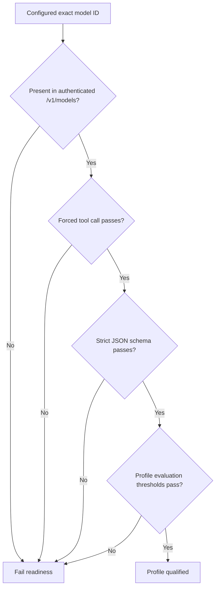

# ADR 005: Qualify exact oMLX model profiles without silent fallback

- Status: Accepted
- Date: 2026-08-20
- Decision owners: AI Engineering, Architecture, and Model Governance

## Context

PorterForcesAI depends on reliable strict JSON-schema output and bounded tool
calling, not just conversational quality. Different quantizations, chat
templates, oMLX releases, and aliases can change those capabilities. A large
production model also slows local development and increases unified-memory
pressure.

The user selected `Qwen3.8-27B-4bit` for fast test execution and DeepSeek for
production. Treating these as interchangeable family names would hide model
changes and make failures difficult to reproduce.

## Decision

Define explicit profiles and require exact model IDs:

| Profile      | Exact model policy                                                                                        | Purpose                                         |
| ------------ | --------------------------------------------------------------------------------------------------------- | ----------------------------------------------- |
| `demo`       | No model                                                                                                  | Deterministic offline development and tests     |
| `live-test`  | `Qwen3.8-27B-4bit`; candidate until the representative contract passes                                | Fast local integration, UI, and acceptance runs |
| `production` | Governance-approved DeepSeek oMLX ID; current intended inventory ID is `DeepSeek-V4-Flash-0731-MXFP4-MLX` | Controlled production-like analysis             |

Configuration uses the OpenAI-compatible oMLX endpoint through the native
LangChain `ChatOpenAI` object. The default endpoint is
`http://127.0.0.1:8000/v1`. Remote endpoints are disabled unless explicitly
approved; when enabled they require HTTPS.

There is no automatic model fallback. If the selected ID is missing, fails a
canary, exhausts local capacity, or violates a structured contract, the live run
fails explicitly. Operators may choose another already-qualified profile as a
new run.

## Qualification requirements

Before an exact model/profile combination is used:

1. authenticated `/v1/models` lists the exact ID;
2. the forced application tool-call canary succeeds;
3. the strict JSON-schema canary succeeds;
4. the bounded research agent exposes only allowed tools under that exact model
   harness profile;
5. offline golden scenarios meet contract-validity and quality thresholds;
6. a live non-confidential scenario demonstrates recorded DuckDuckGo queries,
   candidate reconciliation, capture, and evidence linkage;
7. latency, context use, and unified-memory behavior fit configured concurrency;
8. model/version, oMLX version, prompt version, and evaluation results are
   recorded in release evidence.

Model qualification demonstrates application compatibility. It does not certify
truth, absence of bias, legal compliance, or suitability for a particular board
decision.

## Current qualification evidence

On 2026-08-21, the installed exact Qwen ID passed inventory, forced tool calling,
and the small strict JSON-schema canary. It did not produce a valid
`DecisionFrame` for the representative live request: the JSON-schema response was
free-form/repetitive text, while forced-function variants exceeded their hard
bounds. Disabling or bounding thinking at the request level did not change that
result. The run failed before research and persisted only its failure state.

Accordingly, Qwen remains the requested checked-in test candidate but is not
application-qualified on that installed model/server combination. The small
doctor canary must not be presented as full qualification. See
[local release validation](../release-validation.md) for the bounded results.
DeepSeek likewise remains unqualified until it passes the same representative
contracts and full-run gate; there is no automatic fallback between them.

## Alternatives considered

### Use DeepSeek for every test

Rejected. It slows the development feedback loop and consumes more local
resources without improving deterministic unit coverage. DeepSeek still receives
its own pre-production qualification.

### Automatically fall back from DeepSeek to Qwen

Rejected. A completed run would no longer identify which behavioral profile the
operator selected, and latent model-specific contract defects could be masked.

### Implement a custom model abstraction

Rejected. Deep Agents expects the native LangChain model contract. The standard
OpenAI-compatible adapter preserves tool and structured-output behavior while
keeping model selection in configuration.

### Use a remote hosted model by default

Rejected for the local profile because confidential internal context may enter
decision framing and synthesis. Remote use requires an explicit data-processing
and confidentiality review.

## Consequences

Positive:

- Fast Qwen feedback is reproducible.
- Production DeepSeek changes are explicit and auditable.
- Dependency/model upgrades cannot silently expand research capabilities.
- Operators receive a clear failure rather than an analysis produced by an
  unexpected model.

Costs and limitations:

- Profiles require ongoing evaluation as oMLX, chat templates, prompts, and
  quantizations change.
- Test and production outputs may differ stylistically or substantively; only
  application-owned gates are shared assurance.
- Exact IDs are installation-specific and must be updated through review when a
  production checkpoint changes.
- Local inference still exposes prompts to every process with access to the
  oMLX server and workstation memory.

## Verification

Use `porter-forces doctor --live-canary` with the profile's exact environment.
Archive the machine-readable result with evaluation outputs. Tests mock model
protocol behavior; a pre-release operator also runs at least one bounded live
analysis on Qwen and the intended DeepSeek profile. A protocol-canary pass plus a
representative-contract failure is a failed profile qualification.
