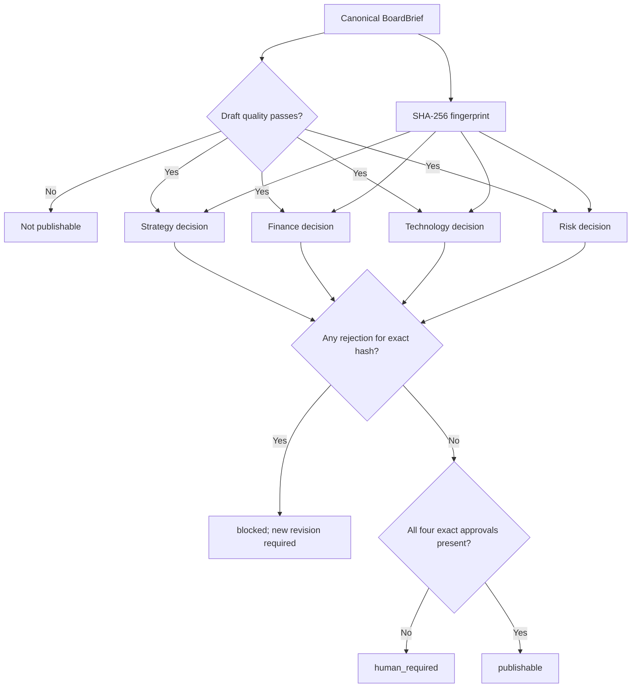

# ADR 006: Require content-bound human approval for publication

- Status: Accepted
- Date: 2026-08-20
- Decision owners: Strategy, Finance, Technology, and Risk

## Context

A board brief combines uncertain market evidence, organization-specific context,
financial assumptions, technical feasibility, and risk acceptance. Deterministic
validation can detect malformed provenance and missing decision elements, but it
cannot assume accountable authority for capital, risk, regulatory, or technology
decisions.

A generic `approved=true` flag on a run is unsafe. A brief can change after
review, and one function cannot approve another function's accountable domain.
The Ralph loop also needs to distinguish machine-achieved draft quality from
human-authorized publication.

## Decision

Separate draft validity from publication authority.

- `achieved_draft` means all required deterministic draft criteria pass.
- `human_required` means the draft is valid but an accountable human decision is
  still required.
- `publishable` means the draft remains valid and Strategy, Finance, Technology,
  and Risk have each approved the exact current brief fingerprint.
- `blocked` means a hard criterion, budget, attempt, stall condition, or current
  reviewer rejection prevents completion.

An `ApprovalRecord` is immutable and contains role, reviewer, review time,
decision, and `brief_sha256`. The repository also links it to the immutable
artifact and verifies that hashes match before insertion.

Any content change produces a new fingerprint. Earlier decisions remain in the
audit log but become stale and have no authority over the new revision. If a
role has both an approval and rejection for the current fingerprint, the current
rejection changes the run to `blocked`. This local release has no workflow for
overriding that decision in place; a new content revision/run must be reviewed.

For a Ralph publishability target, the approval criterion is non-retryable by
generation. Missing approvals produce `human_required`; the model must not keep
rewriting text in an attempt to simulate human consent.

## Role responsibilities

| Role       | Minimum review concern                                                                   |
| ---------- | ---------------------------------------------------------------------------------------- |
| Strategy   | Decision framing, external forces, strategic options, no-action case, and recommendation |
| Finance    | Input ownership, realization logic, NPV/ROI/payback, cost of delay, and capital gates    |
| Technology | Feasibility, architecture, portability, operating model, delivery and exit conditions    |
| Risk       | Control acceptability, model/concentration/cyber/conduct exposure, limits and escalation |

An organization's formal governance may require additional roles. Adding them
strengthens the local policy; it must not remove the four required roles without
a superseding ADR.

## Alternatives considered

### Let Ralph or an LLM critic approve publication

Rejected. It would make the generator or model an authority over human
accountability and create circular assurance.

### One executive approval

Rejected for the base policy. Strategy, financial value, technical feasibility,
and risk acceptance are distinct accountable domains.

### Bind approval only to run ID

Rejected. A run can contain several revisions and artifacts. A run-level flag
can be replayed against content reviewers never saw.

### Delete approvals when a brief changes

Rejected. Old decisions are useful audit evidence. They are retained but marked
stale by fingerprint mismatch.

### Treat rejection as another automated repair request

Rejected as a default. A reviewer rejection is a governance decision, not merely
a formatting defect. A human may authorize a revised run with explicit changes.

## Consequences

Positive:

- Publication authority is explicit, cross-functional, and bound to content.
- Ralph status communicates the difference between machine completion and human
  acceptance.
- Revision history and stale decisions remain auditable.
- The system cannot invent approval from a confidence or quality score.

Costs and limitations:

- Every substantive revision requires fresh review by all required roles.
- Free-text local reviewer identity is sufficient only for the workstation
  profile; enterprise use needs authenticated identity and delegated-role policy.
- SHA-256 binding is not a digital signature or non-repudiation mechanism.
- "Publishable" means this configured process completed; it is not legal,
  regulatory, or investment certification.

## Verification

Automated tests prove:

- zero through three current approvals do not publish;
- all four current approvals plus a valid draft publish;
- any current rejection changes the run to `blocked` and prevents publication;
- a modified brief makes prior approvals stale;
- artifact/run/hash mismatch is rejected by the repository;
- approval rows cannot be updated or deleted;
- the Ralph publication criterion routes missing approvals to `human_required`,
  not another model retry.

The UI shows the exact fingerprint and revision under review, missing roles,
stale approvals, rejections, and the current `draft_valid`/`publishable` state.
