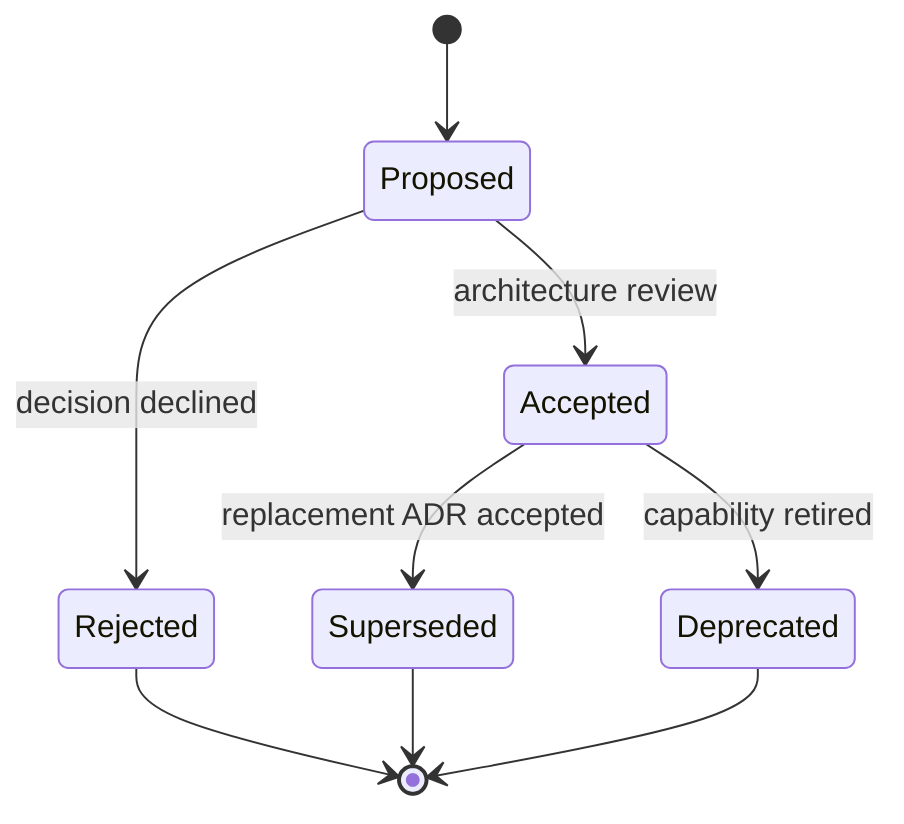

# Architecture decision records

Architecture decision records capture consequential choices, their context,
alternatives, and verification. Accepted records are constraints until they are
superseded by a later ADR; editing history in place should be limited to factual
corrections and links.

| ADR                                      | Status   | Decision                                                                           |
| ---------------------------------------- | -------- | ---------------------------------------------------------------------------------- |
| [001](001-ralph-meta-orchestrator.md)    | Accepted | Use a bounded Ralph meta-orchestrator around the analysis graph.                   |
| [002](002-evidence-snapshot-boundary.md) | Accepted | Treat search as discovery and promote only safely captured page content.           |
| [003](003-sqlite-run-store.md)           | Accepted | Use a local SQLite audit store with append-only provenance records.                |
| [004](004-local-api-and-ui.md)           | Accepted | Expose a loopback FastAPI API and a separate vinext analyst console.               |
| [005](005-model-profiles.md)             | Accepted | Qualify exact oMLX model profiles; use Qwen for tests and DeepSeek for production. |
| [006](006-human-publication-gate.md)     | Accepted | Require content-bound, cross-functional approval before publication.               |

## Lifecycle

New ADRs use the next three-digit sequence and include: status, date, owners,
context, decision, alternatives, consequences, security/operational impact, and
verification.
