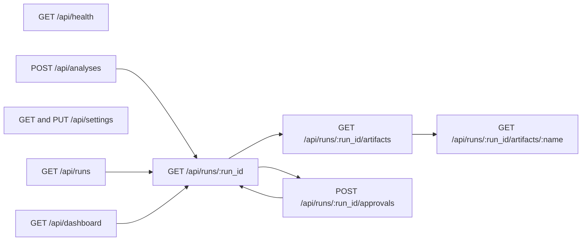
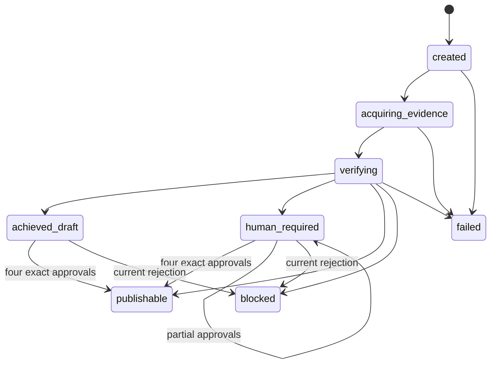

# Local API contract

Status: implemented local FastAPI contract  
Base path: `/api`  
Default origin: `http://127.0.0.1:8765`  
Last reviewed: 2026-08-21

The API supports the analyst console and same-workstation automation. It is not
an internet-facing, multi-user API. FastAPI binds to loopback, trusts only local
hosts, and allows CORS only from the configured loopback UI origin.

## Conventions

- JSON uses UTF-8. Canonical domain fields use `snake_case`; the compact UI
  settings form retains its documented camel-case keys.
- Timestamps are timezone-aware ISO 8601 values.
- IDs are opaque strings. Clients must not infer order or type from an ID.
- `POST /api/analyses` is asynchronous and returns `202`; clients poll the run.
- API request models and nested Pydantic domain models reject unknown fields.
- Completed results survive process restart through a hash-verified immutable
  `analysis_result` artifact. Run-detail redaction walks the complete nested
  response, including Ralph objective/output snapshots.
- Startup marks runs left in `created`, `acquiring_evidence`, or `verifying` as
  failed and closes their open attempts. Checkpoints are durable audit records;
  this release does not resume an interrupted model or network call.
- FastAPI validation errors use its standard `detail` structure. Application
  state conflicts use a short, sanitized `detail` string.

## Resource map



Interactive documentation is local at `/api/docs`; OpenAPI JSON is at
`/api/openapi.json`.

## Endpoints

### `GET /api/health`

Returns process and repository health. It does not contact oMLX, DuckDuckGo, or
public source hosts. Run `porter-forces doctor --live-canary` for model readiness.

```json
{
  "ok": true,
  "service": "porter-forces-ai",
  "model": "Qwen3.8-27B-4bit",
  "model_endpoint": "http://127.0.0.1:8000/v1",
  "database": {
    "schema_version": 2,
    "journal_mode": "wal",
    "foreign_keys": true
  },
  "local_only": true
}
```

The model endpoint is safe operational configuration; the API key is never
returned. `local_only` describes the API binding/profile; a deliberately enabled
remote model endpoint does not change that field.

### `GET /api/dashboard`

Returns the active-run projection, repository counts, and model name used by the
Overview view. `/api/workspace` is an equivalent compatibility route.

```json
{
  "active_run": null,
  "run_count": 0,
  "database_counts": {
    "runs": 0,
    "attempts": 0,
    "goals": 0,
    "queries": 0,
    "hits": 0,
    "captures": 0,
    "artifacts": 0,
    "approvals": 0
  },
  "model": "Qwen3.8-27B-4bit"
}
```

The response contains summaries, not prompts, source bodies, or approval
payloads.

### `GET /api/settings`

Returns the safe settings subset consumed by the console.

```json
{
  "endpoint": "http://127.0.0.1:8000/v1",
  "model": "Qwen3.8-27B-4bit",
  "searchRegion": "us-en",
  "maxSources": 15,
  "apiHost": "127.0.0.1",
  "apiPort": 8765
}
```

### `PUT /api/settings`

Updates the permitted session-scoped, in-memory operational subset. It does not
write `.env` and cannot set API keys, remote-endpoint permission, API bind,
database path, artifact path, Ralph policy, or security gates. Settings are not
versioned or locked per run, so change them only while no analysis is active;
later service reads use the new values.

```json
{
  "endpoint": "http://127.0.0.1:8000/v1",
  "model": "Qwen3.8-27B-4bit",
  "searchRegion": "us-en",
  "maxSources": 12
}
```

The updated `Settings` object is revalidated. A non-loopback endpoint remains
rejected unless remote model use was explicitly enabled at process startup, and
remote HTTP is never accepted.

`maxSources` is the hard limit on unique source-fetch attempts, not a promise of
that many successful captures. A rejected PDF, HTTP failure, timeout, or unsafe
target consumes one slot. The accepted range remains 5–50.

### `POST /api/analyses`

Creates an in-process background job. Demo mode uses labeled synthetic fixtures
without a model or public network. Live mode requires the configured oMLX model,
DuckDuckGo, and safely captured promotable evidence for every Porter force. The
single-worker queue is process-local; a request that has not yet created its run
row is not a durable job.

Canonical request:

```json
{
  "mode": "live",
  "target": "draft",
  "request": {
    "question": "Should a global bank accelerate generative-AI adoption, and what happens if it waits 18 months?",
    "archetype": "global_bank",
    "analysis_mode": "strategic_initiative",
    "organization_name": "Example Bank",
    "industry_arena": "Regulated knowledge-work workflows in global banking",
    "geographies": ["United States", "European Union"],
    "time_horizon_months": 36,
    "audience": ["full_board", "cfo", "cro", "cio"],
    "constraints": ["Stage-gated capital", "Preserve provider portability"],
    "public_research_context": "Public information about regulated bank adoption of generative AI, supplier concentration, customer expectations, substitutes, and peer competition.",
    "restricted_terms": ["confidential-project-codename"],
    "internal_context": {
      "control_posture": "Local-only context; never copy into a public query"
    },
    "evidence_cutoff": "2026-08-21"
  },
  "scenario_economics": [],
  "cost_of_delay": null,
  "max_attempts": 4,
  "max_budget_units": 12,
  "stall_limit": 2
}
```

For live mode, callers must supply the explicit sanitized
`request.public_research_context`. It is the only organization context approved
for public-query planning. Confidential facts belong in `internal_context`, and
distinctive sensitive strings belong in `restricted_terms`.

The live-web MVP captures current pages, not historical archives. It rejects an
`evidence_cutoff` earlier than the current UTC date because it cannot prove
that a present page represents the earlier information set. A current/future
cutoff is carried into query planning; historical analysis needs a separately
supplied dated archive, which this endpoint does not yet accept.

Before fetching, the application fails if any force has no registered candidate.
It then uses the fixed attempt budget coverage-first: uncovered forces receive
round-robin retries after PDFs, HTTP failures, or other rejected captures, and
each failed unique fetch consumes a slot. Once every force has a successful
capture, remaining slots are allocated round-robin with publisher diversity.
The application assigns source class and conservative
quality/freshness/applicability scores from policy. Claim links need an exact
quote from the capture and a lexical-alignment screen for material facts and
inferences. These are provenance/relevance controls, not semantic-entailment or
truth proof.

Each force worker requests one parallel search batch; at most five calls execute,
and excess calls return limit errors without preventing typed bundle synthesis.
Successful query/hit executions are assigned force-scoped sequence IDs and
persisted before tool results return. Thus partial discovery remains in the
acquisition attempt if a later bundle/schema step fails.

`scenario_economics` accepts zero or more typed low/base/high finance scenarios;
`cost_of_delay` accepts the typed deterministic delay inputs. Every range must
name at least one evidence or assumption basis ID and may name an accountable
owner. When these inputs are absent, the service does not invent values and the
board memo says that financial inputs are missing.

The optional Ralph overrides are bounded by the transport contract:
`max_attempts` 1–10, `max_budget_units` 1–100, and `stall_limit` 2–10. Omitting
them uses the locally configured policy.

The console also has a compact form with `target`, `question`,
`organization_type`, `horizon`, `market_boundary`, `internal_context`,
`board_objection`, `evidence_cutoff`, optional `scenario_economics`, and
`research_policy: {"web": false}`. It defaults to demo. Enabling web research
requires a separate explicit sanitized `public_research_context`; the API never
constructs live public context from a possibly confidential question. Unknown
research-policy switches are rejected.

Accepted response:

```json
{
  "run_id": "RUN-20260821T230000Z-2b8f97c1",
  "analysis_id": "RUN-20260821T230000Z-2b8f97c1",
  "id": "RUN-20260821T230000Z-2b8f97c1",
  "status": "running",
  "progress": 1,
  "current_phase": "Queued"
}
```

The compact dashboard can supply one finance scenario when its economics form is
enabled. It does not currently supply cost-of-delay inputs or custom Ralph
bounds; the canonical form and CLI support them. Finance-owned calculations run
before candidate synthesis and are included in the immutable inputs evaluated
by the conditional Ralph economics criterion.

### `GET /api/runs`

Returns newest-first summaries. `limit` defaults to 50 and must be from 1 to 200.
The response merges active in-memory jobs with persisted run summaries while
deduplicating run IDs.

```json
{
  "runs": [
    {
      "id": "RUN-...",
      "run_id": "RUN-...",
      "analysis_id": "RUN-...",
      "status": "awaiting_approval",
      "application_status": "human_required",
      "progress": 99,
      "current_phase": "Human approval",
      "iteration": 1,
      "max_iterations": 3,
      "quality_score": 0.8,
      "model": "deterministic-demo"
    }
  ],
  "count": 1
}
```

Persisted records from an older process initially have a smaller summary, and
their full result is hydrated from the latest verified `analysis_result`
artifact on detail access.

### `GET /api/runs/{run_id}`

Returns a polling projection. While queued or starting, only job fields are
available. A completed result adds `details`, which is the serialized
`AnalysisResult` containing decision frame, research bundles, evidence ledger,
force assessments, board brief, challenge, quality, Ralph state, economics, and
artifact metadata.

```json
{
  "id": "RUN-...",
  "run_id": "RUN-...",
  "analysis_id": "RUN-...",
  "status": "complete",
  "application_status": "achieved_draft",
  "progress": 100,
  "current_phase": "Draft achieved",
  "iteration": 1,
  "max_iterations": 3,
  "quality_score": 1.0,
  "started_at": "2026-08-21T23:00:00+00:00",
  "completed_at": "2026-08-21T23:01:40+00:00",
  "model": "deterministic-demo",
  "error": null,
  "details": {}
}
```

`details.request.internal_context` is replaced with a redaction marker and
`details.request.restricted_terms` is empty. Restricted terms and internal
context keys/values are also replaced wherever they recur in nested strings.
`details.artifact_paths` contains only logical API URLs, never local filesystem
paths. The response uses an `ETag`; send `If-None-Match` to receive `304` when
unchanged.

UI `status` values are `running`, `complete`, `awaiting_approval`, `blocked`, or
`failed`. Terminal failures are not collapsed into a generic paused state.
`application_status` preserves the precise service state: `created`,
`acquiring_evidence`, `verifying`, `achieved_draft`, `human_required`,
`publishable`, `blocked`, or `failed`.

### `GET /api/runs/{run_id}/artifacts`

Returns immutable repository metadata and logical download URLs. It never
returns local filesystem paths.

```json
{
  "run_id": "RUN-...",
  "files": {
    "board_memo": "/api/runs/RUN-.../artifacts/board_memo",
    "evidence_register": "/api/runs/RUN-.../artifacts/evidence_register"
  },
  "artifacts": [
    {
      "artifact_id": "ART-...",
      "type": "board_brief",
      "sha256": "a98c...",
      "schema_version": 1,
      "created_at": "2026-08-21T23:01:40+00:00"
    }
  ]
}
```

### `GET /api/runs/{run_id}/artifacts/{artifact_name}`

Downloads one allowlisted public artifact. Valid logical names are `board_memo`
and `evidence_register`. The response is read from the newest hash-verified,
immutable SQLite payload of the corresponding type; it is not read from a
mutable filesystem path. Arbitrary filenames, traversal, and client-supplied
paths are not accepted.

The JSON audit sidecar remains a restricted local file under the configured run
artifact directory. It contains the unredacted request/internal context plus rich
research, evaluator, and Ralph state, so it is deliberately absent from `files`
and cannot be downloaded through this API.

### `POST /api/runs/{run_id}/approvals`

Appends a decision for the current immutable board artifact. The client does not
choose an artifact ID or hash; the service resolves the run's canonical current
brief, calculates its fingerprint, and the repository verifies that fingerprint
against the immutable artifact before insertion.

```json
{
  "role": "risk",
  "reviewer": "Risk Committee Delegate",
  "decision": "approve"
}
```

`reviewer` is optional only in the local profile; the service records a visible
role-based local label when absent. Decisions accept `approve`/`approved` and
`reject`/`rejected`/`return`/`returned`, normalized to the canonical enum.
Required roles are `strategy`, `finance`, `technology`, and `risk`.

The response is the updated run detail. Fewer than four approvals leaves
`human_required`; all four exact-current approvals with no current rejection and
a valid draft produce `publishable`. A rejection of the exact current brief
changes the run to `blocked`; a new reviewed content revision/run is required.
Changing the brief invalidates prior publication authority while retaining stale
records for audit.

`POST /api/analyses/{run_id}/approvals` is a hidden compatibility alias.

## Status progression



Evidence refresh or material input change creates a new run rather than mutating
a completed run back to `running`.

## Errors

Common responses:

|  HTTP | Condition                                                       |
| ----: | --------------------------------------------------------------- |
| `404` | Unknown run or unavailable allowlisted artifact                 |
| `409` | Approval/run/artifact conflict or invalid approval decision     |
| `422` | Request validation, invalid limits, or rejected settings update |
| `500` | Sanitized unexpected request-handler failure                    |

FastAPI validation example:

```json
{
  "detail": [
    {
      "type": "missing",
      "loc": ["body", "request", "public_research_context"],
      "msg": "Field required",
      "input": {}
    }
  ]
}
```

Long-running live failures appear on the polled job/run as `failed` with a
sanitized error summary; the `202` creation request cannot know their outcome.

At API startup, any persisted nonterminal run is failed closed with an
`InterruptedRunError`, open attempts are marked `interrupted`, and a failure
artifact is appended. Start a new run from the persisted request; there is no
general pause/resume endpoint in this local release.

## Local security behavior

- `TrustedHostMiddleware` accepts only `127.0.0.1`, `localhost`, `[::1]`, and
  `testserver` for in-process tests.
- CORS allows only the configured loopback `PFA_UI_ORIGIN`, without credentials.
- API transport and nested domain request models reject unknown fields.
- Safe settings omit the API key and remote-endpoint toggle.
- Run details recursively redact internal-context keys/values and restricted
  terms, including copies inside nested Ralph state.
- Persisted results are hydrated through hash-verified immutable artifacts; API
  redaction is reapplied after restart.
- Public artifact downloads are reconstructed from hash-verified immutable
  SQLite payloads. Only the memo and evidence register are downloadable; the
  audit sidecar remains local.
- External excerpts are rendered as text, never unsanitized HTML.
- The application launcher rejects a non-loopback API bind.

Loopback is not authentication. Do not expose the port through a public tunnel
or reverse proxy. An authenticated, authorized multi-user API needs a separate
ADR and threat model.

SQLite, `.env`, and run-artifact files are ordinary local plaintext files. Use
workstation disk encryption, restrictive permissions, backups appropriate for a
WAL database, and an approved retention process for confidential work.

## Example local calls

```bash
curl --fail --silent http://127.0.0.1:8765/api/health
curl --fail --silent 'http://127.0.0.1:8765/api/runs?limit=10'
```

The local OpenAPI document is the final machine-readable source for request and
response schemas. This document explains persistence, trust, redaction, and
workflow semantics that field schemas alone do not capture.
