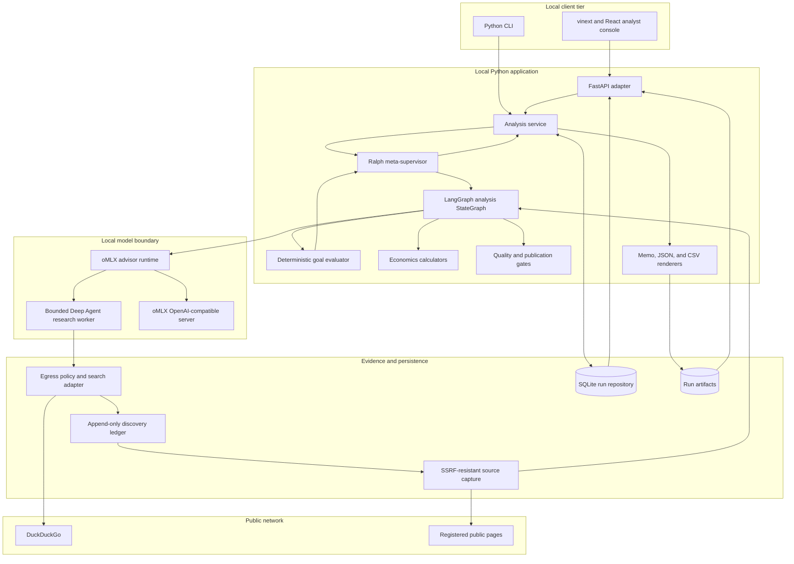
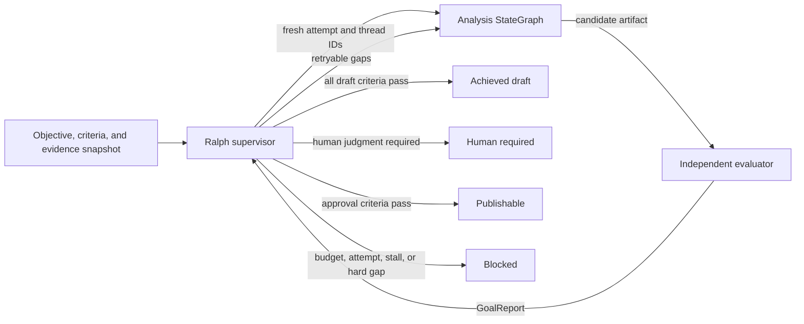
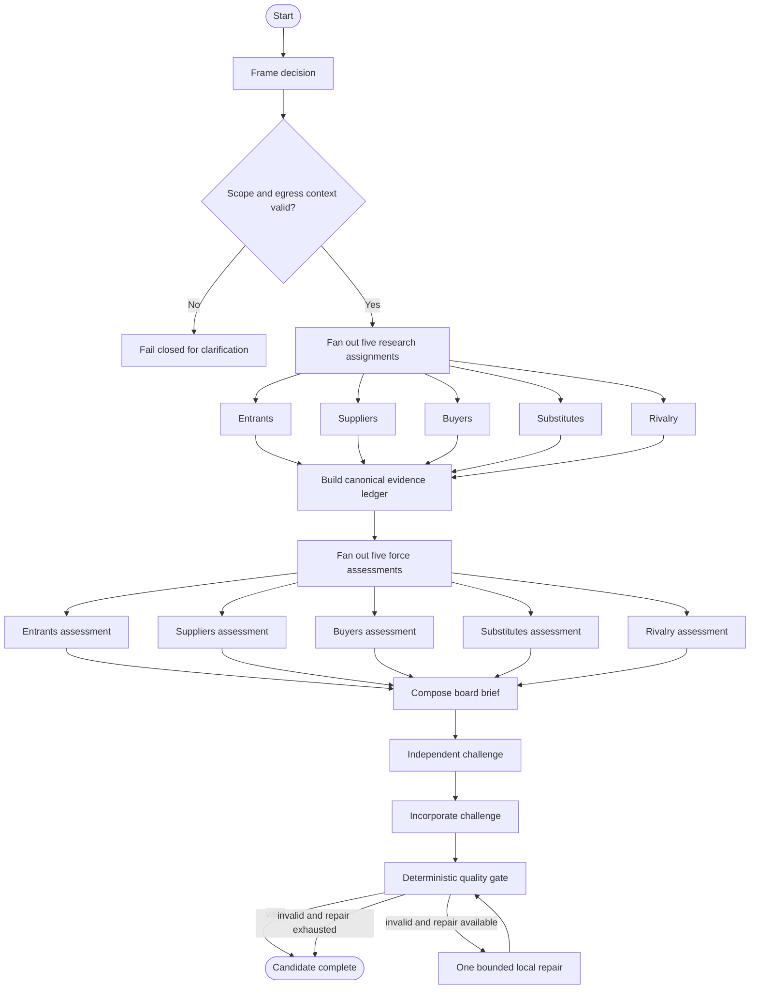
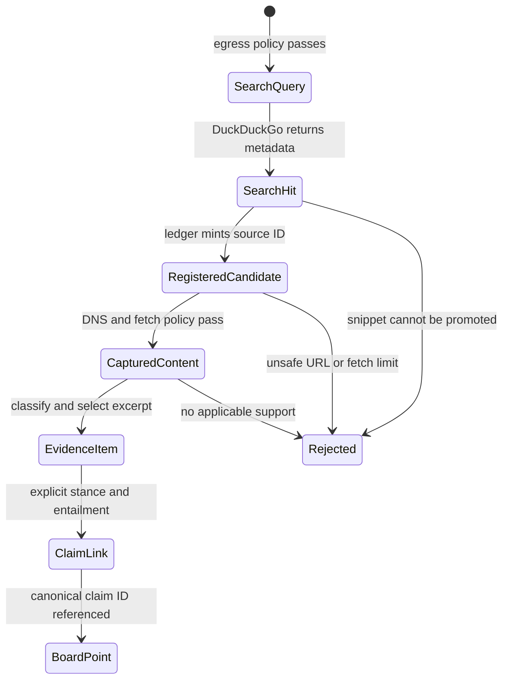
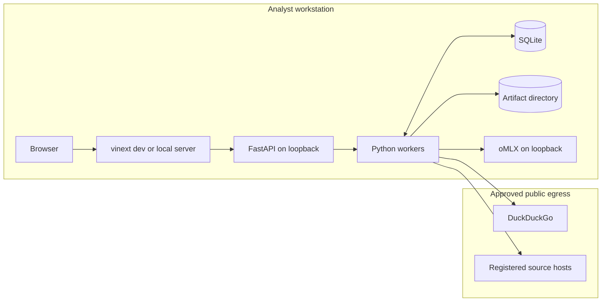

# Technical architecture

Status: implemented core with a local application boundary  
Last reviewed: 2026-08-20

PorterForcesAI is a local-first decision-support system for financial-services
boards. It turns a strategic question into a decision contract, researches
Porter's Five Forces, links claims to captured evidence, computes economics from
owned inputs, challenges the recommendation, and produces reviewable artifacts.
It is not an autonomous financial, legal, regulatory, or investment adviser.

## Architectural principles

1. **The application owns control flow.** LangGraph orders work, fans out the
   five forces, joins results, and runs bounded repair. A model cannot silently
   redefine the process.
2. **Generation and verification are separate.** The inner analysis graph
   produces a candidate; the outer Ralph supervisor applies an independent,
   deterministic definition of done.
3. **Discovery is not evidence.** DuckDuckGo results and snippets only register
   candidates. A public-web item is usable only after bounded page capture,
   hashing, classification, excerpt selection, and claim linkage.
4. **Confidential context stays local.** Only the explicit
   `public_research_context` and generated public queries may cross the search
   boundary. Restricted terms are held outside model-visible research payloads.
5. **Arithmetic is deterministic.** Python calculators own NPV, ROI, payback,
   and cost-of-delay formulas. The LLM may explain results but cannot invent or
   alter inputs.
6. **Draft validity is not publication authority.** Publication requires a
   valid brief plus content-bound approvals from Strategy, Finance, Technology,
   and Risk.
7. **Local is the default trust boundary.** The API, UI, SQLite database, and
   oMLX endpoint bind to loopback unless an operator deliberately approves a
   different deployment.

## Component view

The model boundary and public-network boundary are independent. Local inference
protects prompt confidentiality; it does not make model output factual. Source
capture creates provenance; it does not make untrusted web content safe or
correct. Both outputs still pass application-owned contracts and gates.

## Two-level orchestration

The inner graph is responsible for producing one internally coherent candidate.
The outer loop decides whether that candidate satisfies explicit goals.

Each Ralph attempt uses a fresh nested LangGraph thread and the same immutable
`evidence_snapshot_id`. Gap-specific directives may improve a candidate, but a
retry cannot silently change its evidence universe. A deliberate evidence
refresh starts a new Ralph run.

The analysis StateGraph follows this sequence:

The inner repair is for artifact defects such as invalid references. Ralph is
the overarching goal loop. Neither loop is a claim that a strategic forecast is
true.

## Runtime profiles

| Profile      | Model/network behavior                                                             | Intended use                                                             |
| ------------ | ---------------------------------------------------------------------------------- | ------------------------------------------------------------------------ |
| `demo`       | Deterministic synthetic fixture; no model and no public network                    | UI development, tests, demonstrations                                    |
| `live-test`  | Local oMLX model `Qwen3.8-27B-4bit`; DuckDuckGo and registered-page capture        | Fast local integration and acceptance testing                            |
| `production` | Approved local oMLX DeepSeek model profile; DuckDuckGo and registered-page capture | Controlled production-like runs after model and governance qualification |

Model selection is configuration, not an automatic fallback. Every selected
model must appear in authenticated `/v1/models` and pass forced-tool-call and
JSON-schema canaries before a live analysis.

## Evidence lifecycle

`CapturedContent` remains labeled `untrusted_external_content`. Its hashes make
the captured representation detectable and reproducible; they do not attest to
publisher identity or truth. Evidence scores are review-prioritization signals,
not probabilities.

## Persistence and artifact boundaries

SQLite is the local system of record for run state, attempts, criteria, search
executions, search hits, captures, artifacts, and approvals. It uses foreign
keys and WAL mode. Append-only records retain original inputs and hashes; mutable
run status is a coordination projection, not an authority to rewrite history.

Canonical exported artifacts are:

- `board-brief.md` for board and adviser review;
- `audit-sidecar.json` for structured lineage, evaluator, and Ralph state;
- `evidence.csv` for evidence review.

Artifacts are written through temporary files and atomic replacement. An
approval binds to the SHA-256 fingerprint of the canonical `BoardBrief`, not to
a filename or run ID alone.

## Local deployment

There is no assumption of cloud hosting, SSO, or multi-tenancy. Moving beyond a
single-user loopback deployment requires a separate threat model, authentication
and authorization, TLS termination, tenant isolation, managed secrets, audit
export, retention controls, and load/concurrency qualification.

## Invariants and failure behavior

| Invariant                                      | Enforcement                                                            |
| ---------------------------------------------- | ---------------------------------------------------------------------- |
| Exactly five unique forces                     | Pydantic contracts plus LangGraph fan-in checks                        |
| No public research from confidential fields    | Separate public assignment plus outbound egress policy                 |
| Model-visible research capabilities are narrow | Deep Agents harness profile, bounded calls, and guessed-tool rejection |
| Public claims cite captured content            | Capture hash requirement, canonical ledger, and quality gate           |
| Search snippets are not evidence               | Distinct types and source-promotion boundary                           |
| Force driver weights reconcile                 | `ForceAssessment` validator                                            |
| Financial ranges and units reconcile           | Deterministic economics contracts                                      |
| Board claims match canonical claims            | Runtime and quality-gate equality checks                               |
| Ralph cannot self-certify                      | Independent evaluator and typed `GoalReport`                           |
| Retry evidence is stable                       | Immutable snapshot ID across attempt manifests                         |
| Publication follows human review               | Four content-bound role approvals with no current rejection            |

External failures are explicit: DuckDuckGo failure, rate limiting, capture
failure, model contract failure, exhausted Ralph limits, and human-required
states do not silently fall back to model memory or fabricated evidence.

## Source map

| Concern                          | Implementation                           |
| -------------------------------- | ---------------------------------------- |
| Contracts                        | `src/porter_forces_ai/domain.py`         |
| Inner orchestration              | `src/porter_forces_ai/workflow.py`       |
| Ralph supervision                | `src/porter_forces_ai/ralph.py`          |
| Deep Agent boundary              | `src/porter_forces_ai/research_agent.py` |
| oMLX and DuckDuckGo adapters     | `src/porter_forces_ai/adapters/`         |
| Egress policy                    | `src/porter_forces_ai/egress.py`         |
| Source capture                   | `src/porter_forces_ai/source_capture.py` |
| Deterministic economics          | `src/porter_forces_ai/economics.py`      |
| Quality and publication gates    | `src/porter_forces_ai/quality.py`        |
| Runtime implementations          | `src/porter_forces_ai/runtime.py`        |
| Application service              | `src/porter_forces_ai/service.py`        |
| Loopback FastAPI adapter         | `src/porter_forces_ai/web.py`            |
| Independent acceptance evaluator | `src/porter_forces_ai/evaluation.py`     |
| SQLite repository                | `src/porter_forces_ai/repository.py`     |
| Renderers                        | `src/porter_forces_ai/renderers.py`      |
| Local analyst console            | `ui/`                                    |

See [DFD](dfd.md), [ERD](erd.md), [security model](security.md), [API](api.md),
and [operations](operations.md) for boundary-specific detail.
