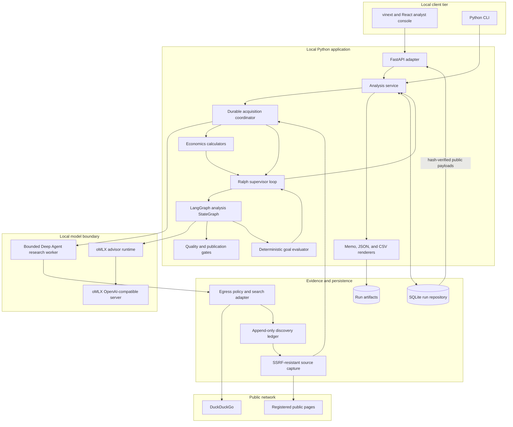
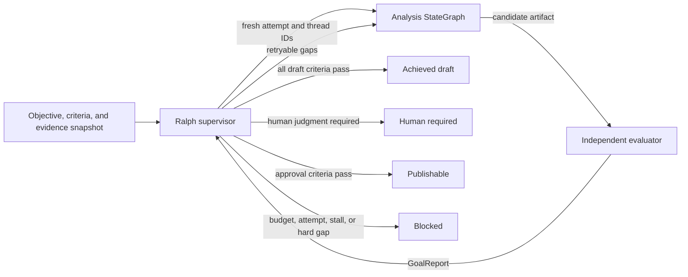
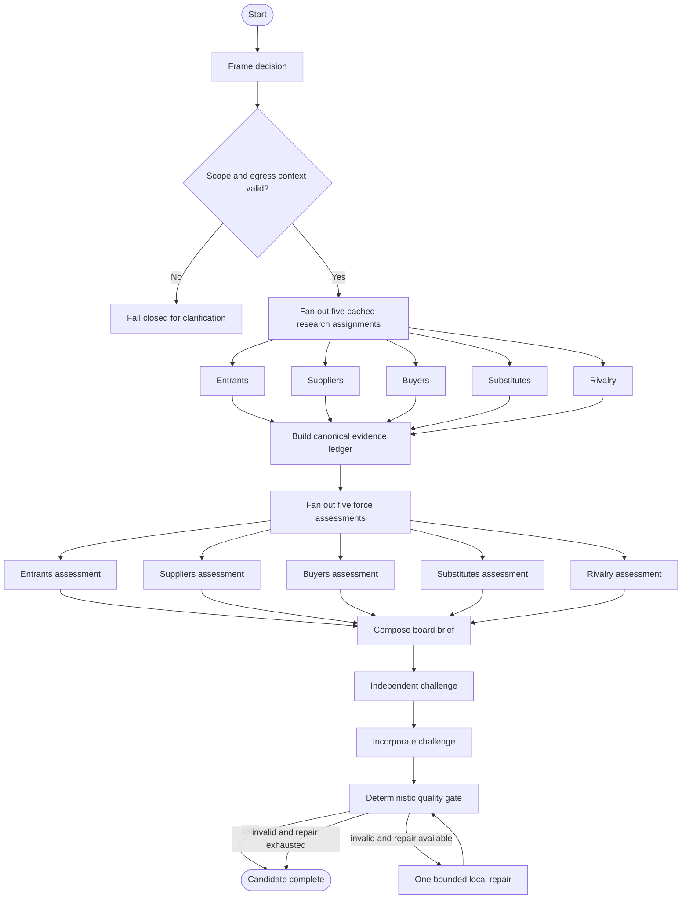
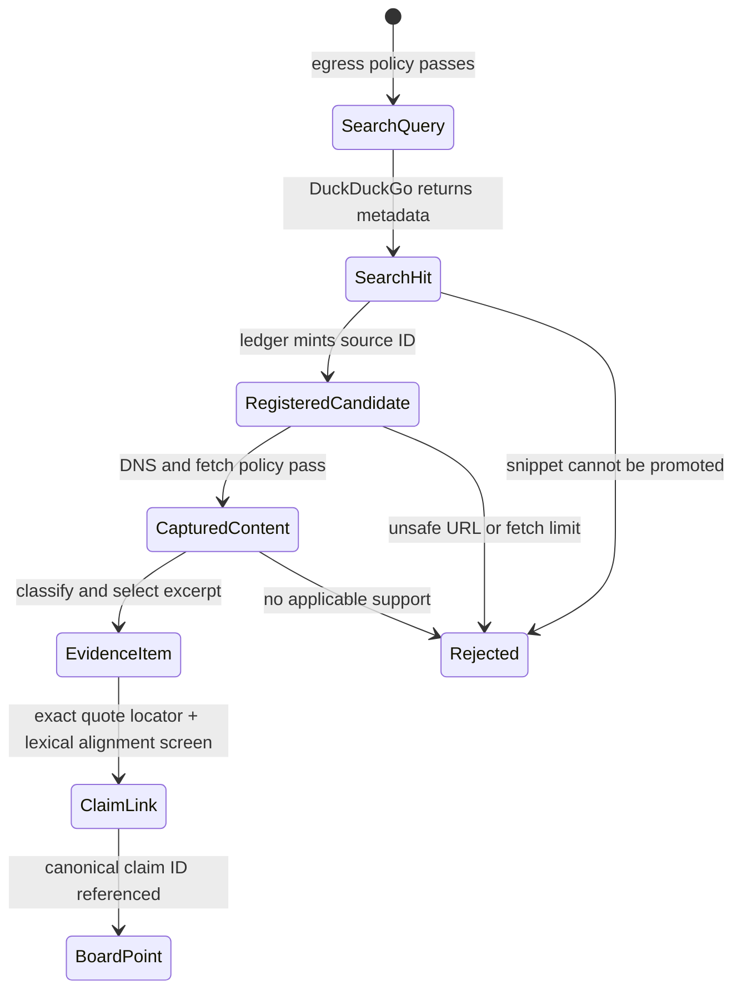
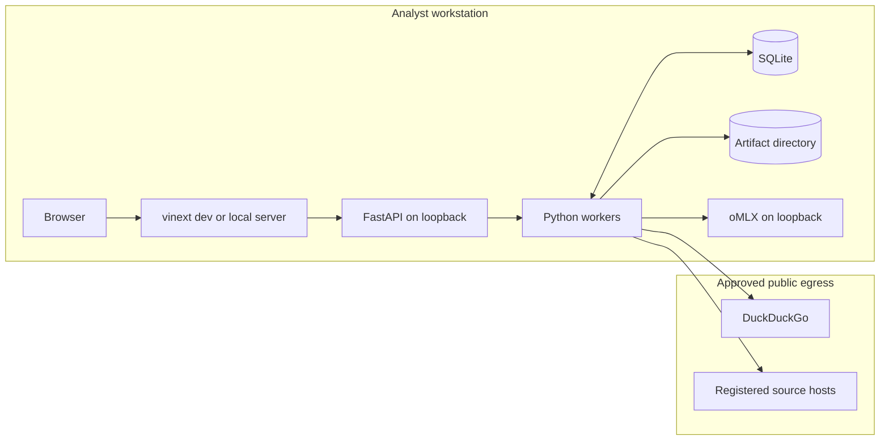

# Technical architecture

Status: implemented core with a local application boundary  
Last reviewed: 2026-08-21

PorterForcesAI is a local-first decision-support system for financial-services
boards. It turns a strategic question into a decision contract, researches
Porter's Five Forces, links claims to captured evidence, computes economics from
owned inputs, challenges the recommendation, and produces reviewable artifacts.
It is not an autonomous financial, legal, regulatory, or investment adviser.

## Architectural principles

1. **The application owns control flow.** LangGraph orders work, fans out the
   five forces, joins results, and runs bounded repair. A model cannot silently
   redefine the process.
2. **Generation and verification are separate.** The inner analysis graph
   produces a candidate; the outer Ralph supervisor applies an independent,
   deterministic definition of done.
3. **Discovery is not evidence.** DuckDuckGo results and snippets only register
   candidates. A public-web item is usable only after bounded page capture,
   hashing, classification, excerpt selection, and claim linkage.
4. **Confidential context stays local.** Only the explicit
   `public_research_context` and generated public queries may cross the search
   boundary. Restricted terms are held outside model-visible research payloads.
5. **Arithmetic is deterministic.** Python calculators own NPV, ROI, payback,
   and cost-of-delay formulas. The LLM may explain results but cannot invent or
   alter inputs.
6. **Draft validity is not publication authority.** Publication requires a
   valid brief plus content-bound approvals from Strategy, Finance, Technology,
   and Risk.
7. **Local is the default trust boundary.** The API and UI bind to loopback, and
   the default oMLX endpoint is loopback. SQLite and generated files remain on
   the local filesystem; local does not mean encrypted or authenticated.
8. **Checkpoints are audit boundaries, not magic resumption.** Acquisition
   provenance is committed as it occurs and every completed Ralph attempt has a
   durable manifest. Startup marks interrupted nonterminal work failed; it does
   not resume a half-finished model or network call.

## Component view

The model boundary and public-network boundary are independent. Local inference
protects prompt confidentiality; it does not make model output factual. Source
capture creates provenance; it does not make untrusted web content safe or
correct. Both outputs still pass application-owned contracts and gates.

## Two-level orchestration

The service acquires and freezes evidence once, calculates any finance-owned
ranges, and then enters Ralph. The inner graph is responsible for producing one
internally coherent candidate from that fixed input. The outer loop decides
whether the candidate satisfies explicit goals.

Each Ralph attempt uses a fresh nested LangGraph thread and the same immutable
`evidence_snapshot_id`. Gap-specific directives may improve a candidate, but a
retry cannot silently change its evidence universe. A deliberate evidence
refresh starts a new Ralph run.

The production service calls one `RalphSupervisor.step` at a time so it can
persist the attempt manifest, latest state checkpoint, and current goal rows
before another retry begins. `RalphSupervisor.build_meta_graph()` exposes the
same transition contract as a compiled StateGraph for other integrations; the
service does not depend on an in-memory outer-graph checkpoint for recovery.

The analysis StateGraph follows this sequence:

In live mode, Deep Agents and DuckDuckGo have already completed during durable
acquisition. The graph's research nodes read the five frozen research bundles;
they do not search again on each Ralph retry. The inner repair is for artifact
defects such as invalid references. Ralph is the overarching goal loop. Neither
loop is a claim that a strategic forecast is true.

Each force research worker is instructed to issue exactly one parallel batch of
no more than five focused searches. The tool middleware executes at most five
search calls; excess calls return explicit limit errors while leaving the model
able to emit the typed `ResearchBundle`. Query IDs are stamped with force-scoped
sequence lineage before execution records are persisted, and concurrent results
are deterministically sorted by that lineage before capture selection.

## Runtime profiles

| Profile      | Model/network behavior                                                             | Intended use                                                             |
| ------------ | ---------------------------------------------------------------------------------- | ------------------------------------------------------------------------ |
| `demo`       | Deterministic synthetic fixture; no model and no public network                    | UI development, tests, demonstrations                                    |
| `live-test`  | Local oMLX model `Qwen3.8-27B-4bit`; DuckDuckGo and registered-page capture        | Fast local integration and acceptance testing                            |
| `production` | Approved local oMLX DeepSeek model profile; DuckDuckGo and registered-page capture | Controlled production-like runs after model and governance qualification |

Model selection is configuration, not an automatic fallback. Every selected
model must appear in authenticated `/v1/models` and pass forced-tool-call and
JSON-schema canaries before a live analysis.

## Evidence lifecycle

`CapturedContent` remains labeled `untrusted_external_content`. Its hashes make
the captured representation detectable and reproducible; they do not attest to
publisher identity or truth. Capture selection is application-owned and
round-robin across the five force-specific candidate sets so one force cannot
consume the global source budget. Source class and the conservative quality,
freshness, and applicability values are also assigned by application policy,
not accepted from model output.

Every claim/evidence link carries a `supporting_quote` that must be an exact
substring of the captured excerpt. For fact and inference claims, the quality
gate also applies a conservative lexical-alignment screen between the claim and
that quote. This catches missing, fabricated, and obviously unrelated locators;
it is not independent semantic entailment, publisher authentication, or proof
that either the source or claim is true. Evidence scores are review-priority
signals, not probabilities.

The local capture profile accepts HTML, XHTML, and plain text only. It cannot
extract PDF, office-document, image, or JavaScript-rendered source content. A
rejected PDF remains an evidence gap until a separately sandboxed extractor is
designed and approved.

The DuckDuckGo adapter treats DDGS's exact `No results found` exception as a
successful empty set, not an outage. When a recency-filtered request is empty it
makes one retry against the same DuckDuckGo backend without the filter and
records that effective filter. An unfiltered empty result remains empty. Timeout,
rate-limit, and every other provider error fail closed as search unavailable.

## Persistence and artifact boundaries

SQLite is the local system of record for run state, acquisition and Ralph
attempts, criteria, search executions, search hits, captures, artifacts, and
approvals. It uses foreign keys and WAL mode. Queries and captures are committed
during acquisition. In live mode the decision frame is checkpointed before
research. Every successful query/hit execution is synchronously persisted before
its tool result returns to the model, so partial discovery survives a later typed
bundle failure. Each completed force bundle is then checkpointed; successful
captures are appended as they complete. After evidence freezes, every completed
Ralph step stores its attempt report and a `ralph_checkpoint` artifact before
another retry.
Append-only records retain original inputs and hashes; mutable run status is a
coordination projection, not an authority to rewrite history.

Canonical exported artifacts are:

- `board-brief.md` for board and adviser review;
- `audit-sidecar.json` for structured lineage, evaluator, and Ralph state;
- `evidence.csv` for evidence review.

Artifacts are written through temporary files and atomic replacement. An
approval binds to the SHA-256 fingerprint of the canonical `BoardBrief`, not to
a filename or run ID alone.

The API serves only the memo and evidence register, directly from immutable,
hash-verified SQLite artifact payloads. It does not serve the audit sidecar,
which can contain local-only request and trace data; authorized operators review
that file through the protected local artifact directory. The SQLite database,
artifact directory, and `.env` are plaintext application files. Full-disk
encryption, filesystem permissions, backup encryption, retention, and secure
deletion are deployment responsibilities.

On API startup, rows left in `created`, `acquiring_evidence`, or `verifying` by a
previous process are marked `failed`, any open database attempts are closed as
`interrupted`, and a failure artifact records the reason. Completed immutable
results are hydrated after restart. Queued/in-progress computation is not
automatically resumed.

## Local deployment

There is no assumption of cloud hosting, SSO, or multi-tenancy. Moving beyond a
single-user loopback deployment requires a separate threat model, authentication
and authorization, TLS termination, tenant isolation, managed secrets, audit
export, retention controls, and load/concurrency qualification.

## Invariants and failure behavior

| Invariant                                      | Enforcement                                                            |
| ---------------------------------------------- | ---------------------------------------------------------------------- |
| Exactly five unique forces                     | Pydantic contracts plus LangGraph fan-in checks                        |
| No public research from confidential fields    | Separate public assignment plus outbound egress policy                 |
| Model-visible research capabilities are narrow | Deep Agents harness profile, bounded calls, and guessed-tool rejection |
| Public claims cite captured content            | Capture hash requirement, canonical ledger, and quality gate           |
| Search snippets are not evidence               | Distinct types and source-promotion boundary                           |
| Force driver weights reconcile                 | `ForceAssessment` validator                                            |
| Financial ranges and units reconcile           | Deterministic economics contracts                                      |
| Owned economics reach the decision              | Pre-synthesis calculation plus conditional Ralph economics criterion   |
| Board claims match canonical claims            | Runtime and quality-gate equality checks                               |
| Requested audiences receive bounded analogies  | Audience-to-analogy Ralph criterion                                    |
| Contrary basis reaches board-visible dissent   | Canonical stance and challenge/dissent Ralph criterion                 |
| User decision and market boundary remain fixed | Request-fidelity Ralph criterion                                       |
| Ralph cannot self-certify                      | Independent evaluator and typed `GoalReport`                           |
| Retry evidence is stable                       | Immutable snapshot ID across attempt manifests                         |
| Publication follows human review               | Four content-bound role approvals with no current rejection            |

External failures are explicit: DuckDuckGo failure, rate limiting, capture
failure, model contract failure, exhausted Ralph limits, and human-required
states do not silently fall back to model memory or fabricated evidence.

## Source map

| Concern                          | Implementation                           |
| -------------------------------- | ---------------------------------------- |
| Contracts                        | `src/porter_forces_ai/domain.py`         |
| Inner orchestration              | `src/porter_forces_ai/workflow.py`       |
| Ralph supervision                | `src/porter_forces_ai/ralph.py`          |
| Deep Agent boundary              | `src/porter_forces_ai/research_agent.py` |
| oMLX and DuckDuckGo adapters     | `src/porter_forces_ai/adapters/`         |
| Egress policy                    | `src/porter_forces_ai/egress.py`         |
| Source capture                   | `src/porter_forces_ai/source_capture.py` |
| Deterministic economics          | `src/porter_forces_ai/economics.py`      |
| Quality and publication gates    | `src/porter_forces_ai/quality.py`        |
| Runtime implementations          | `src/porter_forces_ai/runtime.py`        |
| Application service              | `src/porter_forces_ai/service.py`        |
| Loopback FastAPI adapter         | `src/porter_forces_ai/web.py`            |
| Independent acceptance evaluator | `src/porter_forces_ai/evaluation.py`     |
| SQLite repository                | `src/porter_forces_ai/repository.py`     |
| Renderers                        | `src/porter_forces_ai/renderers.py`      |
| Local analyst console            | `ui/`                                    |

See [DFD](dfd.md), [ERD](erd.md), [security model](security.md), [API](api.md),
and [operations](operations.md) for boundary-specific detail.
