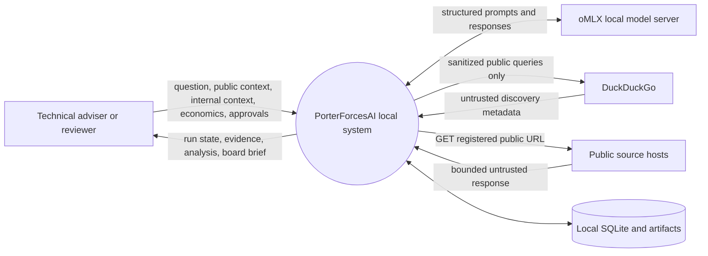
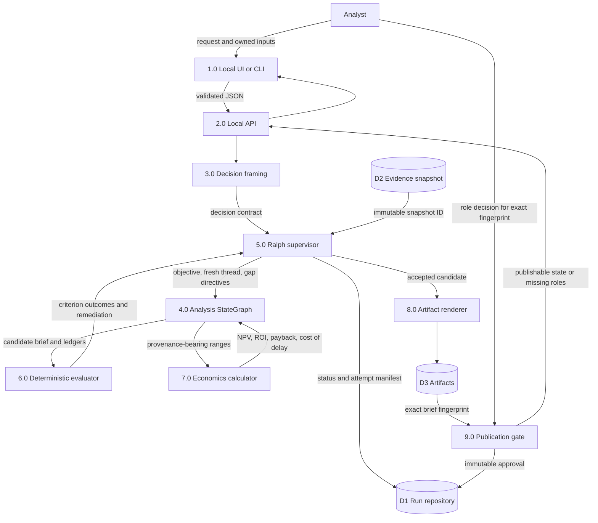
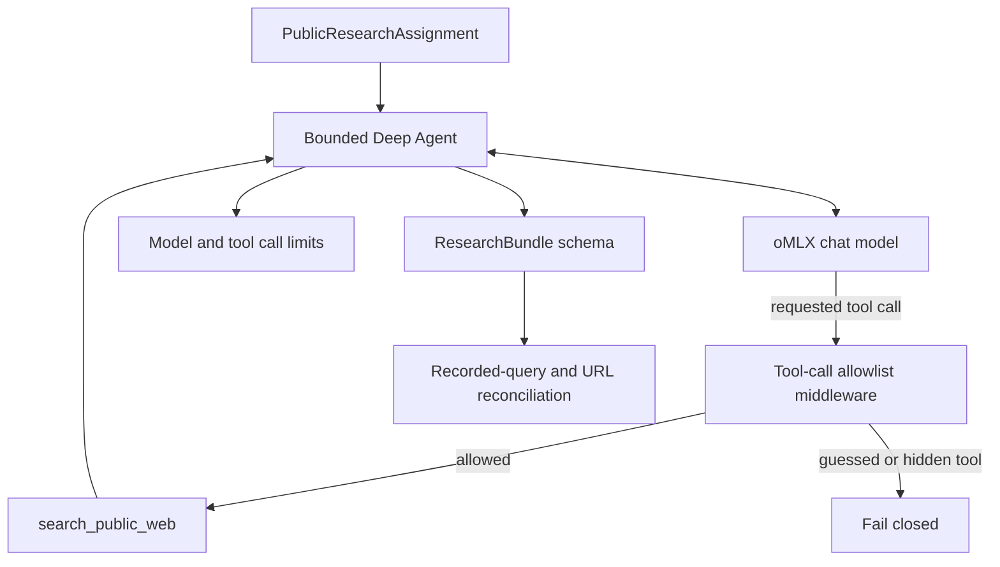
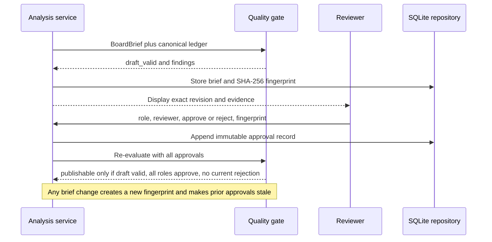
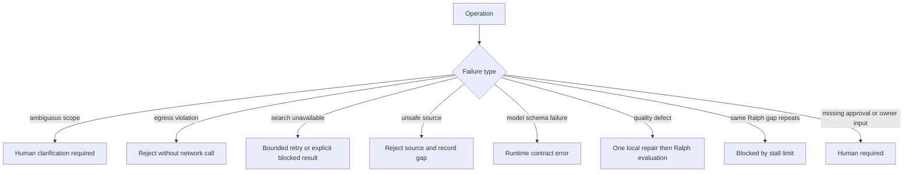

# Data-flow diagrams

Status: normative local design  
Last reviewed: 2026-08-20

These diagrams describe what crosses each trust boundary. They intentionally
separate search discovery, page capture, evidence promotion, and publication.

## Data classes

| Class                     | Examples                                                            | Permitted destinations                                               |
| ------------------------- | ------------------------------------------------------------------- | -------------------------------------------------------------------- |
| Restricted internal       | Internal facts, client names, positions, controls, restricted terms | Local UI, API, service, database, approved local oMLX only           |
| Approved public context   | Sanitized market, geography, product, and time horizon              | Local services, oMLX, DuckDuckGo query planner                       |
| Public untrusted          | Search results, snippets, captured page text                        | Discovery/capture stores and bounded model context; never executable |
| Derived decision material | Claims, assessments, options, economics, brief                      | Local stores and reviewers; publish only after gates                 |
| Security-sensitive        | API keys, configuration, approval identities                        | Local process/configuration; never artifacts or public queries       |

## Level 0: system context

Prohibited flows are as important as the arrows shown: internal context,
restricted terms, model prompts, approval identities, and secrets must not be
sent to DuckDuckGo or public source hosts.

## Level 1: analysis and verification

The evaluator receives the candidate but does not invoke the generator to decide
success. The status `achieved_draft` means deterministic draft criteria passed.
`publishable` additionally requires all current content-bound human approvals.

## Level 2: public research and evidence promotion

```mermaid
flowchart LR
    CTX[Approved public research context]
    PLAN[Hypothesis and query planner]
    EGRESS{Outbound egress policy}
    SEARCH[DuckDuckGo adapter]
    DDG[DuckDuckGo]
    REG[(Executed-query and hit ledger)]
    SELECT[Candidate reconciliation]
    FETCH{Safe capture boundary}
    HOST[Registered public host]
    CAP[(Content-addressed capture)]
    CLASSIFY[Source classification and excerpt selection]
    EVID[(EvidenceItem ledger)]
    LINK[Claim-evidence linker]
    CLAIM[(Canonical claims)]

    CTX --> PLAN
    PLAN -->|query plus rationale| EGRESS
    EGRESS -- reject --> PLAN
    EGRESS -- approved query --> SEARCH
    SEARCH -->|query| DDG
    DDG -->|titles, URLs, snippets| SEARCH
    SEARCH -->|exact query and ordered hits| REG
    REG --> SELECT
    SELECT -->|ledger-minted source ID| FETCH
    FETCH -->|validate DNS on every hop and bounded GET| HOST
    HOST -->|untrusted HTML or text| FETCH
    FETCH -->|hashes, clean text, final URL| CAP
    CAP --> CLASSIFY
    CLASSIFY -->|captured excerpt and source metadata| EVID
    EVID --> LINK
    LINK --> CLAIM
```

Trust-state rules:

1. A `SearchHit` is discovery metadata only. Its snippet cannot support a
   board-visible material claim.
2. Capture accepts a ledger-minted `source_id`, not an arbitrary model-supplied
   URL.
3. DNS is checked before each request and redirect. Private, loopback,
   link-local, reserved, multicast, and non-global addresses are rejected.
4. Redirect count, media types, time, response bytes, and extracted characters
   are bounded. HTTPS downgrade is rejected by default.
5. Captured text remains untrusted external content. Promotion records the
   capture hash, class, publisher, excerpt, scores, applicability, and retrieval
   time.
6. A claim must cite canonical evidence IDs and have matching explicit link
   records. Capture proves what was read, not that the claim is true.

## Level 2: model capability boundary

The research worker's model-visible capability set is the application-owned
search tool and the structured `ResearchBundle` response. Host filesystem,
shell, general-purpose subagents, unrestricted fetching, and final board
recommendation authority are outside that boundary.

## Level 2: human publication flow

## Failure flows

There is no permitted failure route from unavailable evidence to "use model
memory as fact." Model priors remain labeled priors or evidence gaps.
