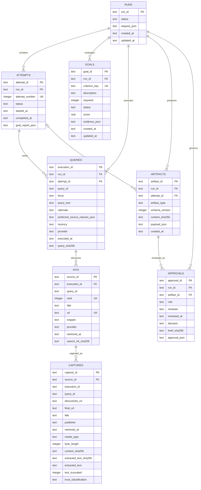
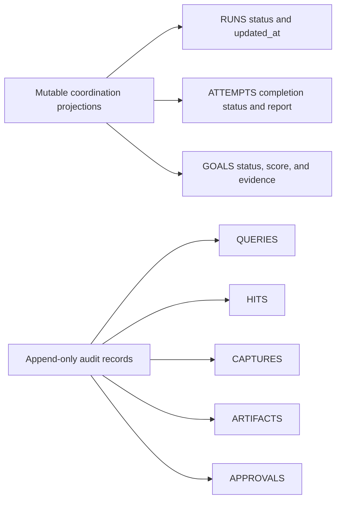

# SQLite entity-relationship design

Status: implemented schema v2  
Last reviewed: 2026-08-20

`SQLiteRunRepository` is the local system of record for run coordination and
audit provenance. The schema is deliberately compact: strongly typed domain
artifacts remain canonical JSON, while columns needed for identity, lineage,
integrity, and operational queries are normalized.

## Entity relationship diagram

`SCHEMA_MIGRATIONS` is omitted from the diagram because it has no domain
relationship. It records `version`, `name`, and `applied_at`; SQLite
`user_version` mirrors the latest applied migration.

## Relationship semantics

| Relationship            | Cardinality and rule                                                                                                                      |
| ----------------------- | ----------------------------------------------------------------------------------------------------------------------------------------- |
| Run to attempt          | A run has zero or more attempts; `(run_id, attempt_number)` and `(run_id, attempt_id)` are unique.                                        |
| Run to goal             | A run has one row per criterion key; goal status is an updatable projection of evaluation history.                                        |
| Attempt to query        | Every executed query belongs to an existing attempt in the same run through a composite foreign key.                                      |
| Query to hit            | Hits are ordered by rank; rank and canonical URL are unique within one execution.                                                         |
| Hit to capture          | Every capture starts from a registered hit. Multiple time-separated captures are representable, although capture IDs are content-derived. |
| Run/attempt to artifact | An artifact always belongs to a run and may be associated with one attempt in that same run.                                              |
| Artifact to approval    | Every approval names an immutable artifact and must carry its exact content SHA-256.                                                      |

All foreign-key deletes use `RESTRICT`. Provenance cannot be erased by deleting a
parent through ordinary repository operations.

## Immutability model

Schema v2 installs `BEFORE UPDATE` and `BEFORE DELETE` triggers for queries,
hits, captures, artifacts, and approvals. The repository inserts these records
inside bounded transactions. Attempts and goals are intentionally mutable
coordination rows; the immutable attempt manifest and rendered audit sidecar
retain the complete Ralph history.

## Content and lineage integrity

| Record     | Integrity mechanism                                                                                                                                                                          |
| ---------- | -------------------------------------------------------------------------------------------------------------------------------------------------------------------------------------------- |
| Query      | SHA-256 of the canonical `ResearchQuery`: ID, force, text, rationale, preferred source classes, and recency. Provider and execution time are stored immutably but are not part of this hash. |
| Search hit | SHA-256 of execution identity, rank, canonical URL, metadata, provider, and retrieval time                                                                                                   |
| Capture    | Registered `source_id` match; discovered URL match; raw-content and extracted-text SHA-256 hashes                                                                                            |
| Artifact   | SHA-256 of canonical JSON payload; recomputed on read                                                                                                                                        |
| Approval   | Foreign key to artifact plus `brief_sha256 == artifact.content_sha256` check in repository service                                                                                           |

The database hashes are tamper-evidence within the local application boundary,
not cryptographic signatures or remote attestation. A workstation administrator
can replace the database and application together; stronger non-repudiation
would require signed manifests and external immutable storage.

## SQLite configuration

On open, the repository applies:

- `PRAGMA foreign_keys = ON`;
- `PRAGMA journal_mode = WAL`;
- `PRAGMA synchronous = NORMAL`;
- `PRAGMA busy_timeout = 5000`;
- numbered, transactional migrations;
- `PRAGMA optimize` during explicit optimization and clean close.

`:memory:` is supported for tests. All other paths are resolved as local
filesystem paths; SQLite URI syntax and network-like URLs are rejected.

## Indexes

Schema v2 creates operational indexes for:

- run status and latest update;
- attempt number by run;
- required goal status by run;
- query execution time by attempt;
- hit rank by query and URL lookup;
- captures by source and retrieval time;
- artifacts by run, type, and creation time;
- approvals by artifact, role, and decision.

## Canonical domain data versus storage rows

The normalized schema does not duplicate every Pydantic field. Canonical request,
goal evidence, attempt report, artifact, and approval payloads are stored as
validated JSON with `json_valid` checks. The application must deserialize them
back through their Pydantic contracts before using them at a gate. SQLite JSON
validity alone is not domain validation.

`CAPTURES.extracted_text` is deliberately retained for evidence review. It is
untrusted public content and must never be executed, interpreted as HTML in the
UI, or included in outbound queries without a new egress review.

## Backup and recovery implications

WAL databases must be backed up with the SQLite backup API or the `sqlite3`
`.backup` command while the service is stopped or quiescent. Copying only the
main database file while a WAL is active can omit committed pages. Artifacts
written outside SQLite must be backed up with the database and correlated by
run and content hash.
