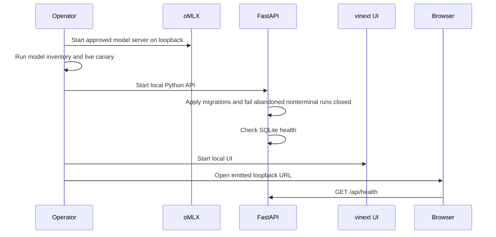
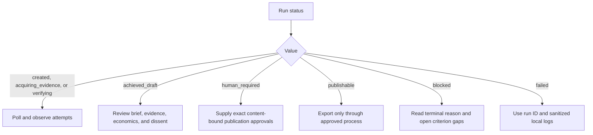

# Local operations runbook

Status: local workstation profile  
Last reviewed: 2026-08-21

This runbook operates PorterForcesAI as a local analyst toolkit. It deliberately
does not describe internet deployment.

## Prerequisites

- macOS or Linux workstation appropriate for the selected oMLX model;
- Python 3.12;
- `uv`;
- Node.js 22.13 or newer and npm;
- a separately installed oMLX server for live mode;
- approved public internet access for DuckDuckGo and source capture.

Demo mode needs neither oMLX nor public network access.

## Initial setup

```bash
git clone <repository-url> PorterForcesAI
cd PorterForcesAI
uv sync --extra dev
cp .env.example .env
cd ui
npm ci
cd ..
```

Keep `.env` local. The standard test profile is:

```dotenv
PFA_LLM_MODEL=Qwen3.8-27B-4bit
PFA_LLM_BASE_URL=http://127.0.0.1:8000/v1
PFA_LLM_API_KEY=test
PFA_ALLOW_REMOTE_MODEL_ENDPOINT=false
```

Use the real local oMLX key if the server requires one. The value `test` is only
a development placeholder. Production uses an explicitly qualified DeepSeek
model ID from that server's `/v1/models` inventory; never assume a friendly name
or silently fall back to Qwen.

## Start sequence



For a complete local launch, use the repository launcher:

```bash
./scripts/setup_and_run.sh
```

For separate development processes:

```bash
uv run porter-forces serve
```

```bash
cd ui
npm run dev
```

Do not bind the standard profile to `0.0.0.0`. The standard launcher uses the
default API and UI ports, 8765 and 3000. If you override `PFA_API_PORT`, also set
the UI proxy target explicitly or start the two processes separately; the Vite
proxy does not read Python's `.env` settings.

The Settings view updates a bounded, session-scoped in-memory model/search
subset; it does not rewrite `.env`. Do not change those values while an analysis
is active because the local service does not version or lock one settings
snapshot per run.

## Readiness checks

### Offline readiness

```bash
uv run pytest
uv run ruff check .
uv run mypy src
cd ui && npm run lint && npm test
```

### oMLX readiness

```bash
PFA_LLM_MODEL=Qwen3.8-27B-4bit uv run porter-forces doctor --live-canary
```

The command must show the selected model in inventory and both tool-calling and
structured-output canaries as true. Do not proceed with a live run if either
canary fails. Demo mode remains available.

### Service readiness

```bash
curl --fail --silent http://127.0.0.1:8765/api/health
```

Confirm database `schema_version`, `journal_mode=wal`, and
`foreign_keys=true`. A basic health request does not prove oMLX answer
quality or public-network availability.

## Running analyses

### Deterministic demo

Use demo mode first. It exercises the real graph, quality gates, Ralph loop,
renderers, repository, API, and UI with visibly labeled synthetic evidence.

```bash
uv run porter-forces demo
```

Or turn **Current public evidence** off in the New Analysis view. That compact
form selects demo mode. Demo output must not be shared as current market
research.

### Live analysis

Before submission:

1. bound the market, geography, and horizon;
2. provide an explicit, sanitized `public_research_context`;
3. put confidential facts only in `internal_context`;
4. add distinctive sensitive strings to `restricted_terms`;
5. supply finance-owned range inputs or accept that ROI will be omitted;
6. select a draft or publication Ralph target deliberately.

```bash
uv run porter-forces analyze examples/global_bank_ai_adoption.json
```

Review exact outbound queries, captured sources, evidence gaps, and quality
findings before relying on the brief. Search failure or uncaptured pages must
appear as an explicit gap, never as model-memory evidence.

Live acquisition accepts HTML, XHTML, and plain-text pages only. PDF, office
documents, images, and JavaScript-only pages are unsupported in the local
profile. A capture rejection is not permission to cite a search snippet.

The application selects captures round-robin across force-specific candidates
and assigns conservative source classes and evidence scores from policy. Claim
links must include an exact quote from the captured excerpt and pass the lexical
alignment screen for facts/inferences. Operators must still judge semantic
entailment, applicability, publisher authority, and truth.

Acquisition and calculation occur before synthesis. Queries and successful
captures are persisted under an acquisition attempt as they occur. In live mode,
the decision frame is checkpointed first, and every force research bundle plus
its exact query/hit lineage is durable. More precisely, each successful search
and hit set is committed synchronously before its tool result returns; a later
bundle/schema failure therefore retains partial discovery. Force-scoped query
IDs make concurrent executions deterministic when ordered. Each worker requests
one parallel batch, and no more than five search calls execute per force.
Finance-owned NPV/ROI/payback and cost-of-delay results are calculated before the
first Ralph attempt. Each completed Ralph attempt then persists its report, goal
rows, and state checkpoint before another retry.

## Run-state response



Do not restart blindly after `blocked`. If the evidence universe changes, create
a new run. The local API does not expose a general resume endpoint. An API
restart marks abandoned `created`, `acquiring_evidence`, and `verifying` rows
failed, closes open database attempts as interrupted, and records a failure
artifact; it does not continue a partial model or network call.

## Human review

At `human_required`, reviewers examine the exact board artifact and its hash.
Strategy, Finance, Technology, and Risk each approve or reject. A brief change
invalidates all previous approvals for publication, although old records remain
in the audit trail.

A rejection blocks that exact revision. The implementation does not ask Ralph
to rewrite a brief to simulate consent; commission a new revision/run after the
review comment is resolved.

Finance must own economic assumptions. Risk/legal approval is not delegated to
the model or inferred from a high quality score.

## Artifacts and storage

Each completed run emits:

- `board-brief.md`;
- `audit-sidecar.json`;
- `evidence.csv`.

The local artifact API exposes only `board_memo` and `evidence_register`. Those
downloads are reconstructed from immutable, hash-verified SQLite payloads, so a
later edit to a file under `runs/` is not served. `audit-sidecar.json` is more
sensitive and is available only through the protected local filesystem, not the
browser API.

The database stores run/attempt status and immutable provenance records. Runtime
database and artifact directories are local data, not source code; keep them out
of Git and apply the organization's retention and classification policy.

SQLite, its WAL/SHM sidecars, generated artifacts, backups, and `.env` are
plaintext application files. PorterForcesAI does not encrypt them. Use full-disk
or volume encryption, restrictive account/file permissions, encrypted backups,
and approved retention and secure-deletion procedures.

The defaults are `data/porter-forces.db` and `runs/<run-id>/`. Override them
with `PFA_DATABASE_PATH` and `PFA_ARTIFACTS_DIR` before startup when the
workstation policy requires an encrypted or access-controlled location.

### Backup

Stop or quiesce the API, then use SQLite's backup operation rather than copying
only the main file while WAL is active:

```bash
sqlite3 path/to/porter-forces-ai.db ".backup 'path/to/backup.db'"
```

Back up the artifact directory in the same recovery set. Verify artifact hashes
after restore. A backup may contain confidential internal context and captured
public text; protect it accordingly.

### Recovery

1. preserve the failed database, WAL, logs, and artifacts read-only;
2. restore the database and artifacts together;
3. start the API on loopback;
4. review any runs startup changed to `failed` with an
   `InterruptedRunError`; do not relabel them complete;
5. verify repository health and table counts;
6. download a sample memo/register so its persisted hash is recomputed;
7. run deterministic tests and a demo before resuming live analyses.

Never repair audit history with direct SQL. Add a migration or explicit recovery
record and retain the original evidence.

## Monitoring

For the local profile, monitor:

- API health and startup migration result;
- run status, acquisition-attempt status, duration, and terminal reasons;
- Ralph attempt count, checkpoint count, goal states, budget units, gap
  fingerprints, and stalls;
- oMLX model ID, latency, schema/tool failures, and context exhaustion;
- DuckDuckGo errors/rate limits and query counts;
- per-force search-limit errors and partial-discovery/bundle-failure correlation;
- capture success/rejection by reason, response bytes, and truncation;
- quality finding codes and missing approvals;
- database size/WAL growth and artifact disk usage.

Logs should use run, attempt, execution, source, capture, artifact, and request IDs.
They must not log API keys, full prompts, internal context, restricted terms,
source bodies, or entire briefs by default.

## Troubleshooting

### Configured model is absent

- Confirm oMLX is running on the configured loopback URL.
- Confirm the API key.
- Run `porter-forces doctor --json` and copy the exact inventory ID into
  `PFA_LLM_MODEL`.
- Do not substitute another model automatically.

### Tool or JSON-schema canary fails

- Confirm the exact chat template/model combination supports tool calls and
  strict structured output.
- Inspect oMLX server logs without exposing prompt content.
- Reduce model concurrency and retry the explicit canary.
- Keep live analysis disabled until qualified.

### DuckDuckGo is unavailable

- Confirm approved public egress and DNS.
- An exact DDGS `No results found` condition is not an outage. A filtered search
  receives one same-provider unfiltered retry; an unfiltered search may
  truthfully return no hits.
- Timeout, rate-limit, and other provider exceptions fail closed. Respect rate
  limits; do not switch providers silently.
- Use demo mode or end the live run with a visible research gap.

### Source capture rejects a page

- Read the typed rejection: unregistered ID, unsafe DNS, redirect limit,
  downgrade, media type, size, timeout, or empty text.
- Do not bypass capture or paste a search snippet into evidence.
- Nominate another public source through a newly recorded search execution.
- For PDF or other unsupported media, locate an authoritative HTML/plain-text
  equivalent; do not add an ad hoc parser to a live run.

### Ralph blocks

- Inspect the last `GoalReport`, directives, terminal reason, and gap fingerprint.
- Repeated identical fingerprints indicate no measurable progress; changing
  prose alone is not progress.
- Missing publication approvals are handled as `human_required`, not repeated
  generation. Missing finance calculations stay explicitly absent.
- Refreshing evidence creates a new run and snapshot.

### Database reports lock/busy

- Ensure only the intended API process writes the local database.
- Allow the configured five-second busy timeout.
- Stop duplicate processes, checkpoint/backup correctly, and restart.
- Do not delete `-wal` or `-shm` files from a running database.

### UI loads but has no data

- Call `/api/health` directly.
- Verify the UI points to the emitted local API origin.
- Check browser network failures, local Host/Origin policy, and API logs.
- Demo data may be a design fixture; distinguish it visually from repository
  runs.

## Shutdown

Stop accepting new runs, let the current bounded worker reach a terminal state,
stop the UI, stop FastAPI cleanly so SQLite optimizes/closes, and then stop oMLX.
The API shutdown drains the active worker and cancels work that has not started.
The single-worker queue is process memory; a queued request that has not created
its repository run is not recoverable after shutdown or crash.
After an unclean stop, the next API startup records interrupted nonterminal runs
as failed. Preserve blocked, human-required, and failed history; do not delete
incomplete runs.

## Production-readiness gate

The local profile is not automatically production-ready. Before use in a formal
board process, require:

- exact DeepSeek model and prompt/template qualification;
- model-risk, security, privacy, records, and legal review;
- approved source and egress policy;
- role-based reviewer identity rather than free-text local names;
- signed/exported audit manifests if non-repudiation is required;
- backup, retention, recovery, and incident-response exercises;
- concurrency and unified-memory capacity tests;
- outcome monitoring against realized decisions;
- an explicit statement of human accountability and limitations in every
  published artifact.
