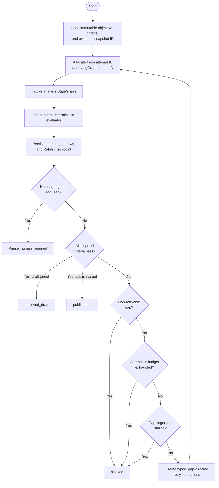
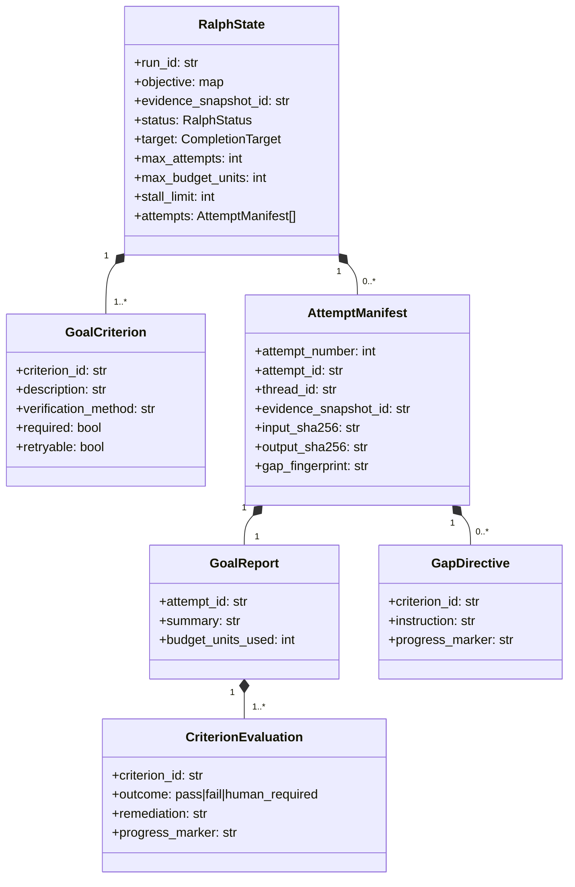

# Ralph goal-supervisor loop

The Ralph supervisor wraps a complete analysis StateGraph. Its typed `step`
transition runs fresh attempts until an independent evaluator verifies explicit
acceptance criteria, or until the run reaches a human decision, a hard limit, or
a provable stall. The same transition can run as a compiled meta-StateGraph or,
as in the local service, one durably persisted step at a time.

It does **not** guarantee that a strategy is objectively true. It guarantees
that the declared, deterministic definition of done was enforced and that the
analysis graph could not certify its own output.

## Control flow



## Persistent state



`RalphState` and every nested record are frozen Pydantic contracts. Rebuilding
persisted state validates contiguous attempt numbers, unique attempt and thread
IDs, budget reconciliation, and the invariant that every attempt used the same
`evidence_snapshot_id`.

The snapshot ID freezes the evidence universe for a run. A deliberate evidence
refresh starts a new Ralph run; retries cannot silently cherry-pick a changing
search result set.

## Integration API

`RalphSupervisor` accepts either a compiled graph exposing `invoke(input,
config)` or a two-argument callable. The default attempt input is the original
objective. Gap context is always available under `config["metadata"]["ralph"]`.
An optional input builder can also place typed directives into an analysis
state field.

```python
from porter_forces_ai.ralph import (
    CompletionTarget,
    GoalCriterion,
    RalphSupervisor,
)
from porter_forces_ai.evaluation import evidence_snapshot_id

supervisor = RalphSupervisor(
    analysis_graph,
    deterministic_goal_evaluator,
    input_builder=build_gap_directed_analysis_input,
)
state = supervisor.new_state(
    objective={"request": decision_request},
    criteria=(
        GoalCriterion(
            criterion_id="G-evidence",
            description="Every material claim has usable evidence.",
            verification_method="evaluate_brief quality gate",
        ),
    ),
    evidence_snapshot_id=evidence_snapshot_id(evidence_ledger.evidence),
    target=CompletionTarget.DRAFT,
    max_attempts=4,
    max_budget_units=12,
    stall_limit=2,
)
result = supervisor.run(state)
```

`supervisor.build_meta_graph()` compiles the same step contract as a LangGraph
StateGraph and accepts `{"ralph_state": state}`. Each nested analysis execution
receives a new `configurable.thread_id`; callers may give that graph a separate
checkpointer and thread.

The implemented application service deliberately calls `supervisor.step`
inside a bounded Python loop. After every completed step it commits the database
attempt, goal results, and immutable `ralph_checkpoint` before allowing another
retry. Evidence acquisition has its own preceding database attempt and is
finished as `evidence_frozen`. This is durable audit recovery, not continuation
of a half-finished model invocation: API startup marks abandoned nonterminal
runs failed and tells the operator to start a new run from the persisted request.

## Evaluator rules

The evaluator must return exactly one result for every criterion. The
supervisor rejects missing, duplicate, or unexpected results. Required results
route as follows:

| Evaluation | Supervisor action |
|---|---|
| all `pass` | `achieved_draft` or `publishable`, depending on target |
| any `human_required` | pause as `human_required`; do not retry |
| a non-retryable `fail` | `blocked` |
| retryable `fail` with capacity | create directives and run a fresh attempt |
| limits or stall reached | `blocked` |

An evaluator should use deterministic quality gates, canonical ledgers,
calculation checks, and approval fingerprints. An LLM critique may produce
candidate issues, but it must not be the authority that changes Ralph status.

The implemented draft definition of done checks the decision contract, all five
forces, evidence/claim integrity, board-decision completeness, fidelity to the
user question and supplied market boundary, audience-specific analogies, and a
canonical contrary basis shared by the challenge and board-visible dissent. If
finance-owned scenario or delay calculations exist, an additional criterion
checks that the exact values reach synthesis and the challenge and that wholly
negative cases are described conservatively. Publication adds exact-content
human approval.

Evidence integrity requires each claim link's `supporting_quote` to occur
verbatim in the captured excerpt and applies a conservative lexical-alignment
screen for material facts and inferences. That is a locator/relevance control,
not an independent semantic-entailment judgment or proof of source truth.

## Stall and budget semantics

A gap fingerprint hashes the sorted criterion IDs, outcomes, and explicit
`progress_marker` values for all open gaps. Free-form explanation wording does
not defeat stall detection. Reaching `stall_limit` consecutive identical
fingerprints blocks the run.

Each report declares deterministic `budget_units_used`. The supervisor records
the consumed amount in the immutable attempt manifest and will not retry at or
above `max_budget_units`. The application evaluator currently charges one unit
per completed analysis attempt; this is a retry budget, not measured tokens,
currency, or wall-clock time.

## Human pause

`human_required` is a terminal result for the current invocation, not a failed
retry. In the implemented publication flow it means that an otherwise valid
exact brief still lacks one or more Strategy, Finance, Technology, or Risk
approvals. Approvals are appended outside generation and recompute the
publication gate for that same immutable brief. A rejection blocks the current
revision and requires a new content revision/run; it is never treated as an
automated writing instruction.

Ambiguous live scope and acquisition/model failures fail explicitly rather than
masquerading as human pauses. Missing finance inputs remain visibly missing and
the economics criterion is omitted; the model may not invent ROI. Evidence
refresh or any material input change creates a new run and snapshot. There is no
general pause/resume endpoint in the local API.
