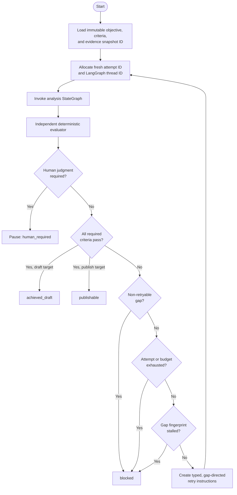
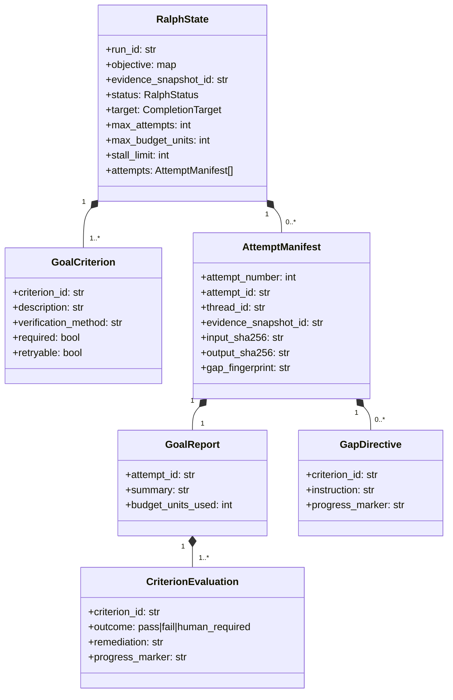

# Ralph goal-supervisor loop

The Ralph supervisor wraps a complete analysis StateGraph. It runs fresh
attempts until an independent evaluator verifies explicit acceptance criteria,
or until the run reaches a human decision, a hard limit, or a provable stall.

It does **not** guarantee that a strategy is objectively true. It guarantees
that the declared, deterministic definition of done was enforced and that the
analysis graph could not certify its own output.

## Control flow



## Persistent state



`RalphState` and every nested record are frozen Pydantic contracts. Rebuilding
persisted state validates contiguous attempt numbers, unique attempt and thread
IDs, budget reconciliation, and the invariant that every attempt used the same
`evidence_snapshot_id`.

The snapshot ID freezes the evidence universe for a run. A deliberate evidence
refresh starts a new Ralph run; retries cannot silently cherry-pick a changing
search result set.

## Integration API

`RalphSupervisor` accepts either a compiled graph exposing `invoke(input,
config)` or a two-argument callable. The default attempt input is the original
objective. Gap context is always available under `config["metadata"]["ralph"]`.
An optional input builder can also place typed directives into an analysis
state field.

```python
from porter_forces_ai.ralph import (
    CompletionTarget,
    GoalCriterion,
    RalphSupervisor,
)

supervisor = RalphSupervisor(
    analysis_graph,
    deterministic_goal_evaluator,
    input_builder=build_gap_directed_analysis_input,
)
state = supervisor.new_state(
    objective={"request": decision_request},
    criteria=(
        GoalCriterion(
            criterion_id="G-evidence",
            description="Every material claim has usable evidence.",
            verification_method="evaluate_brief quality gate",
        ),
    ),
    evidence_snapshot_id=evidence_ledger.snapshot_id,
    target=CompletionTarget.DRAFT,
    max_attempts=4,
    max_budget_units=12,
    stall_limit=2,
)
result = supervisor.run(state)
```

For checkpointed orchestration, call `supervisor.build_meta_graph()` and invoke
the returned compiled StateGraph with `{"ralph_state": state}`. Each nested
analysis execution receives a new `configurable.thread_id`; the meta-graph may
use a separate checkpointer and thread.

## Evaluator rules

The evaluator must return exactly one result for every criterion. The
supervisor rejects missing, duplicate, or unexpected results. Required results
route as follows:

| Evaluation | Supervisor action |
|---|---|
| all `pass` | `achieved_draft` or `publishable`, depending on target |
| any `human_required` | pause as `human_required`; do not retry |
| a non-retryable `fail` | `blocked` |
| retryable `fail` with capacity | create directives and run a fresh attempt |
| limits or stall reached | `blocked` |

An evaluator should use deterministic quality gates, canonical ledgers,
calculation checks, and approval fingerprints. An LLM critique may produce
candidate issues, but it must not be the authority that changes Ralph status.

## Stall and budget semantics

A gap fingerprint hashes the sorted criterion IDs, outcomes, and explicit
`progress_marker` values for all open gaps. Free-form explanation wording does
not defeat stall detection. Reaching `stall_limit` consecutive identical
fingerprints blocks the run.

Each report declares deterministic `budget_units_used`. The supervisor records
the consumed amount in the immutable attempt manifest and will not retry at or
above `max_budget_units`. Actual token and wall-clock observability can be
translated into units by the evaluator or runtime adapter.

## Human pause

`human_required` is a terminal result for the current invocation, not a failed
retry. Typical causes include missing finance-owned assumptions, legal or risk
acceptance, ambiguous scope, or publication approval. Continuing after human
input should create a new evidence snapshot and Ralph run when the evidence
universe changes; otherwise, a future explicit resume API may retain the same
snapshot while recording the human decision as a new immutable artifact.
