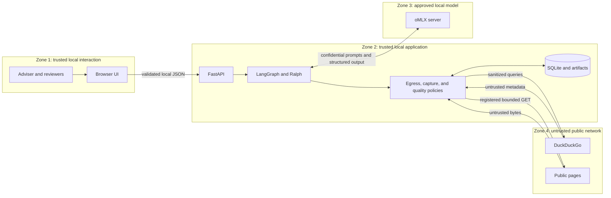

# Security and trust model

Status: local single-user threat model  
Last reviewed: 2026-08-20

The most important security property is not "the model is local." It is that
confidential inputs, public egress, untrusted content, model capabilities,
evidence promotion, and publication authority are separated and auditable.

## Scope and assumptions

This model assumes:

- one trusted operator on a managed workstation;
- UI, FastAPI, SQLite, artifacts, and oMLX bind to loopback;
- the operating-system account and repository are trusted;
- public egress is limited to DuckDuckGo and registered HTTP(S) source hosts;
- no untrusted user has local shell or filesystem access;
- publication still occurs through an accountable human process.

It does not cover public hosting, multi-tenancy, hostile local administrators,
malware on the workstation, or a compromised model server. Those deployments
require a new threat model.

## Trust zones

Crossing from Zone 2 to Zone 4 is the principal confidentiality boundary.
Crossing from Zone 4 back to Zone 2 is the principal content-integrity boundary.

## Security objectives

| Objective              | Required property                                                                                                             |
| ---------------------- | ----------------------------------------------------------------------------------------------------------------------------- |
| Prompt confidentiality | Internal context goes only to approved local components and oMLX.                                                             |
| Outbound minimization  | Only sanitized public query text leaves the workstation.                                                                      |
| SSRF resistance        | Model output cannot fetch arbitrary hosts; each target and redirect is validated and bounded.                                 |
| Capability confinement | Research agents cannot use host filesystem, shell, general subagents, or unrestricted URL fetch.                              |
| Provenance integrity   | Queries, hits, captures, artifacts, and approvals retain identities and SHA-256 hashes.                                       |
| Content safety         | Public content is labeled untrusted, normalized to text, never rendered as executable HTML, and never granted tool authority. |
| Decision integrity     | Material board points resolve to canonical claims and evidence/assumption IDs.                                                |
| Publication authority  | Four accountable roles approve the exact current brief fingerprint.                                                           |
| Availability bounds    | Tool/model calls, redirects, bytes, characters, attempts, budgets, and stalls have hard limits.                               |

## Implemented controls

### Confidentiality and egress

- `DecisionRequest` separates `public_research_context` from
  `internal_context`.
- `restricted_terms` stay outside the model-visible
  `PublicResearchAssignment`; the egress policy rejects matching queries.
- Public queries have length bounds. Search explicitly selects the DuckDuckGo
  backend and has no hidden provider fallback.
- Remote model endpoints are rejected unless
  `PFA_ALLOW_REMOTE_MODEL_ENDPOINT=true`; non-loopback remote endpoints also
  require HTTPS.
- Local oMLX HTTP clients ignore environment proxies, preventing accidental
  forwarding of prompts through corporate proxy configuration.

The query guard is deterministic string policy, not a data-loss-prevention
system. Paraphrases, encoded values, or facts not listed as restricted can still
leak. Operators must sanitize `public_research_context` and review outbound
policy for sensitive deployments.

### Agent capability boundary

- The research worker receives a force-specific public assignment rather than
  the full internal decision request.
- The model-visible tool set is limited to `search_public_web` and the
  `ResearchBundle` structured response.
- Deep Agents filesystem/shell scaffolding is excluded for the exact model
  profile; the general-purpose subagent is disabled.
- Middleware rejects guessed or hidden tool names.
- Model and search tool calls have explicit per-run limits.
- Search candidates are reconciled to URLs actually observed by the recording
  provider.

These controls constrain consequences; they do not make model behavior trusted.

### URL and source capture

- Source capture accepts a ledger-minted `source_id`, not an arbitrary URL.
- URLs reject credentials, local names, private/non-global IP literals, malformed
  ports, fragments, and tracking parameters.
- The resolver checks every address before the initial request and every manual
  redirect; private, loopback, link-local, reserved, multicast, and unspecified
  ranges are rejected.
- Automatic redirects and environment proxies are disabled.
- Redirect count, timeout, content type, declared/observed response bytes, and
  extracted text length are bounded.
- HTTPS-to-HTTP redirect downgrade is disabled by default.
- HTML scripts, styles, templates, SVG, canvas, and `noscript` content are
  removed during plain-text extraction.
- Raw bytes and extracted text receive separate SHA-256 hashes.

Residual SSRF caveat: validation resolves a hostname before the HTTP client
performs its own connection resolution. A hostile DNS service may exploit that
time-of-check/time-of-use gap. Before exposing capture to untrusted users or
high-assurance networks, pin the validated IP to the connection while retaining
the original TLS hostname, or place fetches in a network sandbox with explicit
egress allow rules.

### Evidence and prompt-injection containment

Search snippets never become `EvidenceItem` instances. Captured content remains
classified as `untrusted_external_content`; promotion requires source class,
publisher, captured hash, excerpt, applicability, and quality values. Claims and
explicit claim-evidence links must reconcile.

Public text can contain prompt-injection instructions. Normalizing HTML to text
removes executable markup but not malicious language. The structured model
prompts tell the model to treat it as evidence data, and model tool capability is
narrow; deterministic validators then constrain IDs and publication. This
reduces impact but does not prove semantic immunity. High-risk runs require
human source review, source allowlists, and/or an isolated evidence extraction
model with no tools.

### Persistence and approval integrity

- SQLite foreign keys, JSON validity constraints, unique keys, and transactional
  migrations are enabled.
- Queries, hits, captures, artifacts, and approvals are append-only through
  database triggers.
- Artifact hashes are recomputed on read.
- Repository insertion verifies an approval's run, artifact, and exact SHA-256.
- Quality evaluation ignores stale approvals and blocks publication when any
  required role is missing or a current reviewer rejected.

SHA-256 records are tamper-evident only relative to the local database and
application. They are not digital signatures. An administrator able to replace
both can forge history.

## Local API and browser controls

The implemented local adapter and launcher provide:

- a settings-enforced loopback API bind;
- a local `Host` allowlist and narrow CORS for the configured UI origin;
- strict API and nested domain request schemas;
- redaction of internal-context values and restricted terms from run details,
  including hydrated results after restart;
- allowlisted logical artifact downloads confined beneath the configured root;
- safe React text rendering of public excerpts; and
- settings responses that omit model API keys and remote-endpoint permission.

Before any wider or higher-assurance deployment, add explicit request-body
limits, `Cache-Control: no-store` for sensitive responses, authenticated reviewer
identities, structured log redaction tests, and a restrictive browser Content
Security Policy.

Loopback is not authentication. A malicious website can attempt localhost CSRF,
and DNS rebinding can target local services. Host/origin validation and
non-idempotent JSON POST semantics are required even in the local profile. If
the service binds beyond loopback, add authenticated identities, role-based
authorization, CSRF protection, TLS, rate limiting, and audit-grade session
records before use.

## Threat analysis

| Threat                      | Example                                        | Controls                                                                                     | Residual action                                           |
| --------------------------- | ---------------------------------------------- | -------------------------------------------------------------------------------------------- | --------------------------------------------------------- |
| Confidential query leakage  | Internal client or project name reaches search | Public/internal split, restricted-term egress guard                                          | Operator review and enterprise DLP integration            |
| Prompt injection            | Captured page tells model to ignore policy     | Text-only capture, no fetch tool in evidence stage, schemas, ID reconciliation, human review | Source allowlist and isolated extractor for high-risk use |
| SSRF                        | Redirect targets metadata service or localhost | Ledger source IDs, URL and DNS validation on each hop, no auto-redirect/proxy                | Network sandbox or IP-pinned connection                   |
| Hallucinated citation       | Model invents or edits URL/evidence ID         | Recording provider reconciliation, capture requirement, canonical link gate                  | Human source validation                                   |
| Tool escalation             | Model guesses shell or filesystem tool         | Exact profile exclusion and tool-call middleware                                             | Contract tests on every dependency/model upgrade          |
| Model endpoint exfiltration | Operator configures remote HTTP model          | Remote disabled by default; remote requires explicit flag and HTTPS                          | Formal third-party/model data review                      |
| Artifact tampering          | Brief changed after review                     | Canonical hashes and immutable artifact/approval records                                     | External signing for non-repudiation                      |
| Stale approval              | Old approval reused for revised brief          | Exact brief fingerprint; stale approvals ignored                                             | Reviewer UI must show revision and hash                   |
| Resource exhaustion         | Infinite agents, giant pages, repeated retries | Tool, byte, redirect, attempt, budget, and stall bounds                                      | OS/process quotas and concurrency limits                  |
| Cross-site local request    | Hostile webpage calls local API                | Loopback, Host/Origin allowlist, narrow CORS, JSON POST                                      | Add local auth token if browser threat increases          |
| Unsafe HTML display         | Evidence page contains script                  | Plain-text extraction and React text rendering                                               | Content Security Policy and no raw HTML APIs              |

## Secrets and configuration

- Keep `.env` out of Git. Commit only `.env.example` with blank or placeholder
  values.
- A local development API key such as `test` is not a production secret and
  must not be reused outside the workstation.
- Restrict database, artifact, and environment-file permissions to the operator.
- Do not put secrets in `public_research_context`, run names, filenames, CLI
  arguments visible in process listings, or screenshots.
- Rotate a real oMLX API key after suspected disclosure and re-run the model
  canary.

## Security validation checklist

- Egress tests prove restricted terms are rejected before the provider call.
- Agent contract tests prove only the allowed tool schema is exposed and guessed
  calls fail.
- URL tests cover private IPv4/IPv6, numeric hosts, local suffixes, redirects,
  downgrade, invalid media types, large/chunked bodies, and proxy bypass.
- Repository tests cover foreign-key failures, immutable triggers, hash
  verification, cross-run artifacts, and approval mismatch.
- API tests cover Host/Origin checks, response redaction, request sizes, invalid
  paths, and stale approval conflicts.
- UI tests verify excerpts are text, not HTML.
- Dependency and model upgrades rerun tool-call and structured-output canaries.

## What a passing run does not prove

A passing quality gate and Ralph goal report prove that the configured contracts
were enforced over a named evidence snapshot. They do not prove source truth,
future market outcomes, regulatory compliance, control effectiveness, or
fitness for a real capital decision. Those remain accountable human judgments.
