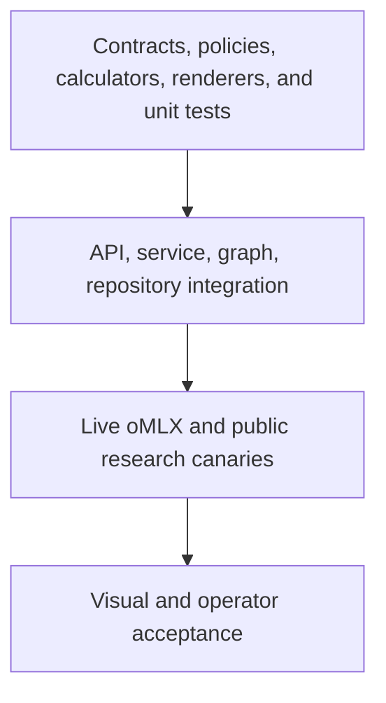
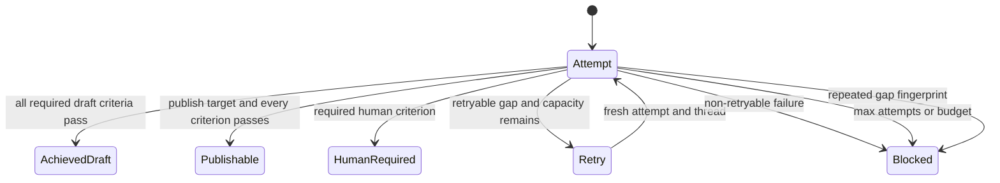

# Testing and verification strategy

Status: executable local test strategy  
Last reviewed: 2026-08-20

Testing is arranged so that most defects are reproducible without a model or
network. Live oMLX, DuckDuckGo, source-host, and browser checks are separate
acceptance layers because availability is not deterministic.

## Verification pyramid



The lower layers run on every change. Live and visual layers run before a model
profile or release is declared qualified.

## Test layers

| Layer                     | What it establishes                                                                                                     | External dependencies         |
| ------------------------- | ----------------------------------------------------------------------------------------------------------------------- | ----------------------------- |
| Pydantic contracts        | Invalid identities, URLs, options, weights, provenance, ranges, and approvals fail closed                               | None                          |
| Deterministic economics   | Range ordering, units, NPV, ROI, payback, delay formula, and edge cases                                                 | None                          |
| Egress and search adapter | Restricted terms, canonical URLs, provider selection, deduplication, and failure behavior                               | Mocked provider               |
| Deep Agent contract       | Tool allowlist, no host capabilities, call limits, and structured `ResearchBundle` boundary                             | Mocked oMLX HTTP contract     |
| Source capture            | Discovery registration, SSRF checks, redirects, media/size limits, extraction, hashing, and promotion                   | Mocked resolver/client        |
| Quality gate              | Canonical claims, links, entailment, evidence utility, assumptions, warnings, and content-bound approvals               | None                          |
| Inner LangGraph           | Five-force fan-out/fan-in, ordering, scope failure, one bounded repair, and checkpoint reset                            | Fake runtime                  |
| Ralph                     | Fresh threads, snapshot invariance, pass/retry/pause/block routes, budget, attempts, and stall                          | Fake analysis/evaluator       |
| Repository                | Migrations, WAL/FK health, transactions, append-only triggers, lineage, hash checks, and conflicts                      | Temporary SQLite              |
| Runtime                   | Complete deterministic demo and structured oMLX contract boundaries                                                     | Demo or fake model/search     |
| API                       | Endpoint schemas, async lifecycle, redaction, approval transitions, and local security headers                          | In-process ASGI client        |
| UI                        | Production build, server rendering, navigation/content smoke checks, responsive and accessible visual review            | Local UI server/browser       |
| Live profile              | Exact model inventory, tool calling, JSON schema, DuckDuckGo, registered source capture, and one bounded end-to-end run | Local oMLX and public network |

## Standard commands

From the repository root:

```bash
uv sync --extra dev
uv run pytest
uv run ruff check .
uv run mypy src
```

From `ui/`:

```bash
npm ci
npm run lint
npm test
```

`npm test` performs a production vinext build before the rendered-HTML smoke
test. Run `npm run build` separately when diagnosing build output.

## Determinism rules

- Unit tests do not call oMLX, DuckDuckGo, DNS, or arbitrary public hosts.
- IDs and clocks are injectable where ordering or hashes are asserted.
- Demo-mode evidence is labeled synthetic and user-provided; tests must never
  present it as current public research.
- Decimal values are used for financial arithmetic; expected results use exact
  values or documented rounding.
- Graph tests validate typed artifacts and state transitions, not prose style.
- Ralph tests use an independent fake evaluator and prove that an analysis
  output cannot mark itself complete.
- Hash tests serialize through the same canonical JSON rules as production.

## Ralph acceptance matrix



Required automated cases are:

1. first-attempt draft success;
2. one gap-directed retry followed by success;
3. publishable target with exact approvals;
4. immediate `human_required` pause;
5. maximum-attempt block;
6. budget block;
7. stall-fingerprint block;
8. evidence snapshot tampering rejection;
9. missing, duplicate, and unexpected criterion evaluation rejection;
10. compiled LangGraph meta-loop behavior.

## Evidence-security matrix

| Case                                         | Expected result                       |
| -------------------------------------------- | ------------------------------------- |
| Search snippet nominated as evidence         | Rejected; no captured-content hash    |
| Model invents candidate URL                  | Removed during reconciliation         |
| Unregistered URL passed to capture           | `SourceNotRegisteredError`            |
| Host resolves to loopback/private/link-local | `UnsafeSourceURLError` before fetch   |
| Safe first URL redirects to private host     | Redirect rejected before next request |
| HTTPS redirects to HTTP                      | Rejected by default                   |
| Missing/disallowed content type              | Capture rejected                      |
| Declared or streamed body exceeds limit      | Capture rejected                      |
| HTML contains script/style content           | Excluded from extracted text          |
| Claim IDs and link IDs differ                | Quality error                         |
| Material fact has no usable entailed support | Quality error                         |
| Evidence changes inside Ralph retry          | Goal criterion fails                  |

## Model qualification

The test profile is the exact oMLX ID `Qwen3.8-27B-4bit`. The production profile
uses the approved DeepSeek ID exposed by that oMLX installation. Do not qualify a
family name or assume aliases are stable.

Run inventory and canaries:

```bash
PFA_LLM_MODEL=Qwen3.8-27B-4bit \
PFA_LLM_BASE_URL=http://127.0.0.1:8000/v1 \
PFA_LLM_API_KEY=test \
uv run porter-forces doctor --live-canary
```

The canary must prove:

- authenticated `/v1/models` access;
- the configured exact ID is present;
- one forced application tool call is syntactically and semantically valid;
- one strict JSON-schema response validates.

Then run one bounded live analysis with a non-confidential public context and
inspect its recorded queries, candidate reconciliation, captures, evidence
hashes, claim links, quality findings, and Ralph manifest. Model canaries prove
protocol capability, not answer quality.

## API acceptance

For every endpoint, test success and failure shapes. Especially verify:

- run creation returns `202` quickly and does not block the event loop;
- unknown runs return `404` without leaking filesystem/database information;
- malformed and extra fields fail validation;
- approval hash/artifact/run mismatch returns `409`;
- partial approvals retain `human_required`;
- a rejection prevents publication;
- all four current approvals allow `publishable` only when `draft_valid` is true;
- secrets and internal context are absent from health, dashboard, settings,
  errors, and routine run summaries;
- non-local Host/Origin values fail in the standard local profile.

## UI visual acceptance

Exercise Overview, New Analysis, Ralph Monitor, Five Forces, Evidence,
Economics, Board Brief, Review, and Settings at desktop and narrow mobile widths.

Check:

- navigation and keyboard focus are visible;
- text and status colors meet contrast expectations;
- long questions, source titles, hashes, URLs, and findings wrap without overlap;
- loading, empty, degraded, error, human-required, blocked, draft, and publishable
  states are distinct;
- synthetic demo evidence is visibly labeled;
- excerpts render as plain text;
- no horizontal page overflow appears at supported widths;
- buttons and tabs work through actual interaction, not screenshot inspection
  alone.

## Release evidence

A local release is acceptable when:

1. Python tests, Ruff, and strict mypy pass;
2. UI lint, build, and rendered-HTML tests pass;
3. database migrations succeed from an empty file and health reports WAL/FK;
4. deterministic demo produces all canonical artifacts;
5. the chosen oMLX profile passes live canaries;
6. a live run either produces captured, traceable evidence or fails explicitly
   with evidence gaps—never with snippet/model-prior claims presented as facts;
7. browser QA covers all analyst-console views;
8. documentation links and Mermaid fences validate;
9. the worktree contains no secrets or generated runtime database/artifacts.

## Interpreting a green suite

A green suite establishes conformance to contracts and tested failure modes. It
does not establish that DuckDuckGo is complete, sources are truthful, the model
is unbiased, an economic assumption is owned, or a board recommendation will
perform as forecast. Those require source review, accountable input owners,
model governance, and outcome monitoring.
